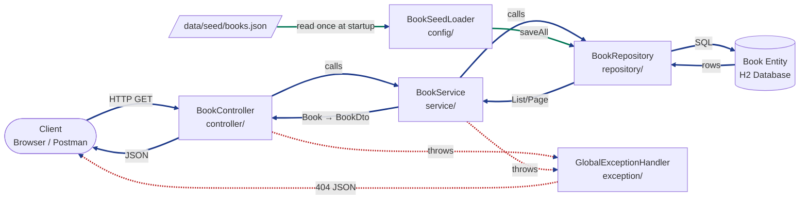
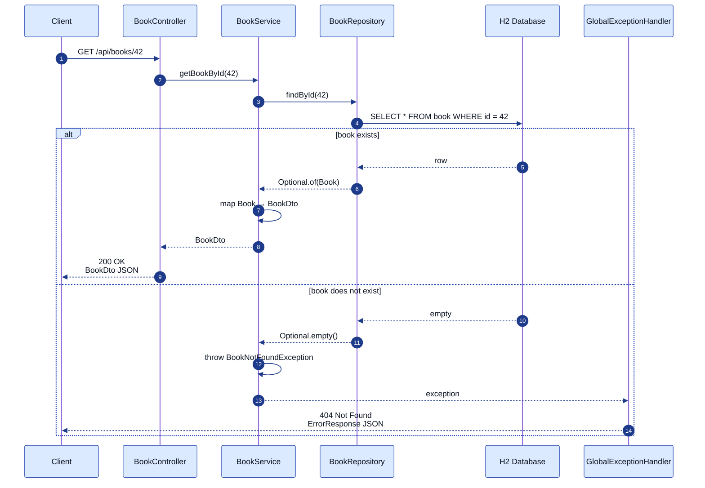

# Technical Design: Browse Book Catalogue

| Field | Value |
|---|---|
| **Feature ID** | FEAT-01 |
| **Corresponds To Spec** | [feature-01-browse-catalogue.md](../specs/feature-01-browse-catalogue.md) |
| **Corresponds To Plan** | [feature-01-browse-catalogue-plan.md](../plans/feature-01-browse-catalogue-plan.md) |
| **Status** | Draft — Awaiting Developer Review |
| **Author** | AI Assistant (drafted for review) |

---

## 1. Purpose of This Document

This document translates the approved [Plan](../plans/feature-01-browse-catalogue-plan.md) into a **code-ready design**. Every open decision from the Plan (D-01 through D-08) is answered here. After you approve this design, the Coding stage should be almost mechanical — no more architectural thinking required.

---

## 2. Traceability

This design implements:

- Every requirement in [spec §3, §5, §6, §7](../specs/feature-01-browse-catalogue.md).
- Every phase and file listed in [plan §4, §5](../plans/feature-01-browse-catalogue-plan.md).

---

## 3. Overview

The system for this feature is a single Spring Boot backend that:

1. Loads a JSON seed file into an in-memory H2 database on startup.
2. Exposes two REST endpoints — one paginated list, one single-book lookup.
3. Returns JSON responses shaped as DTOs (never the raw entity).
4. Handles the "book not found" case with a 404 JSON error response.

No frontend. No authentication. No writes from the API. Truly the smallest possible slice that teaches every layer of Spring Boot.

---

## 4. Architecture — Layer Diagram



**Reading the diagram:**

- **Blue solid arrows** — normal request/response flow.
- **Red dashed arrows** — exception flow (any exception routes through `GlobalExceptionHandler` before reaching the client).
- **Green solid arrows** — startup-only seed flow. The seed loader runs **once**, at application startup, before the app accepts any HTTP requests. It reads the JSON file and inserts rows through the repository. After that, it never runs again during that process's lifetime.

---

## 5. Request Flow — Sequence Diagrams

### 5.1 List books (`GET /api/books`)

```mermaid
%%{init: {'theme':'default','themeVariables':{'actorBorder':'#1e40af','actorBkg':'#dbeafe','actorTextColor':'#0b1220','signalColor':'#1e3a8a','signalTextColor':'#0b1220','labelBoxBkgColor':'#dbeafe','labelBoxBorderColor':'#1e40af','noteBkgColor':'#fef3c7','noteBorderColor':'#92400e','sequenceNumberColor':'#ffffff','fontSize':'14px'}}}%%
sequenceDiagram
    autonumber
    participant C as Client
    participant Ctrl as BookController
    participant Svc as BookService
    participant Repo as BookRepository
    participant DB as H2 Database

    C->>Ctrl: GET /api/books?page=0&size=12
    Ctrl->>Ctrl: build Pageable<br/>(page=0, size=12, sort=createdAt DESC)
    Ctrl->>Svc: listBooks(pageable)
    Svc->>Repo: findAll(pageable)
    Repo->>DB: SELECT * FROM book<br/>ORDER BY created_at DESC<br/>LIMIT 12 OFFSET 0
    DB-->>Repo: rows
    Repo-->>Svc: Page&lt;Book&gt;
    Svc->>Svc: map each Book → BookDto<br/>(compute availability from stockQuantity)
    Svc-->>Ctrl: Page&lt;BookDto&gt;
    Ctrl->>Ctrl: wrap in PagedResponse
    Ctrl-->>C: 200 OK<br/>PagedResponse&lt;BookDto&gt; JSON
```

**Reading the diagram:**

- **Solid arrows (`→`)** — a method call going forward through the layers.
- **Dashed arrows (`-->`)** — a return value coming back up the stack.
- Numbers on the left mark each step so you can walk through them in order.

### 5.2 Get single book (`GET /api/books/{id}`)



**Reading the diagram:**

- **Solid arrows (`→`)** — a forward method call.
- **Dashed arrows (`-->`)** — a return value (or an exception being thrown out) coming back up the stack.
- The `alt` block splits into two possible paths — the top branch is the happy path (book found), the bottom branch is the "not found" case that ends in a 404 response through the global exception handler.

---

## 6. Data Model

### 6.1 The `book` table

```sql
CREATE TABLE book (
    id                BIGINT           NOT NULL AUTO_INCREMENT PRIMARY KEY,
    isbn              VARCHAR(13)      NOT NULL UNIQUE,
    title             VARCHAR(500)     NOT NULL,
    description       CLOB             NOT NULL,        -- H2's "long text" type
    cover_image_url   VARCHAR(1000)    NOT NULL,
    publisher         VARCHAR(255),                     -- nullable
    published_date    VARCHAR(50),                      -- nullable, stored as string (see notes)
    page_count        INTEGER,                          -- nullable
    language          VARCHAR(10)      NOT NULL,        -- ISO code, e.g. 'en'
    category          VARCHAR(100)     NOT NULL,
    price             DECIMAL(10, 2)   NOT NULL,        -- INR, always ≥ 0.01
    stock_quantity    INTEGER          NOT NULL DEFAULT 0,
    created_at        TIMESTAMP        NOT NULL
);

CREATE INDEX idx_book_created_at ON book(created_at DESC);
CREATE INDEX idx_book_category   ON book(category);
```

### 6.2 The `book_authors` join table

Because a book can have multiple authors and each author is just a name string (no separate Author entity yet — resolves D-02), we model `authors` as an **element collection**. JPA creates a small join table:

```sql
CREATE TABLE book_authors (
    book_id    BIGINT       NOT NULL,
    author     VARCHAR(255) NOT NULL,
    FOREIGN KEY (book_id) REFERENCES book(id) ON DELETE CASCADE
);

CREATE INDEX idx_book_authors_book_id ON book_authors(book_id);
```

### 6.3 Notes on column choices

| Column | Choice | Reason |
|---|---|---|
| `published_date` as `VARCHAR` | String | Open Library returns dates in inconsistent formats: `"2020"`, `"2020-05"`, `"2020-05-15"`. Parsing all of them into `LocalDate` is fragile and offers no value at this stage — we only display the value, we don't sort or filter by it. |
| `description` as `CLOB` | Long-text | Book descriptions can exceed the 4KB default `VARCHAR` limit some DBs impose. |
| `price` as `DECIMAL(10, 2)` | Fixed-precision decimal | Resolves **D-04**. Never use `double` for money — floating point rounding causes bugs. `BigDecimal` in Java maps to `DECIMAL` in SQL. |
| `id` as `BIGINT` auto-increment | Long | Standard JPA convention. Room for growth beyond `Integer` range. |
| `created_at` index | Descending | Every list query orders by `created_at DESC`; the index makes it free. |

---

## 7. Entity Design — `Book.java`

Location: `backend/src/main/java/com/harsh/bookstore/entity/Book.java`

```java
package com.harsh.bookstore.entity;

import jakarta.persistence.*;
import java.math.BigDecimal;
import java.time.LocalDateTime;
import java.util.ArrayList;
import java.util.List;

@Entity
@Table(name = "book")
public class Book {

    @Id
    @GeneratedValue(strategy = GenerationType.IDENTITY)
    private Long id;

    @Column(nullable = false, unique = true, length = 13)
    private String isbn;

    @Column(nullable = false, length = 500)
    private String title;

    @ElementCollection(fetch = FetchType.EAGER)
    @CollectionTable(
        name = "book_authors",
        joinColumns = @JoinColumn(name = "book_id")
    )
    @Column(name = "author", nullable = false)
    private List<String> authors = new ArrayList<>();

    @Lob
    @Column(nullable = false)
    private String description;

    @Column(name = "cover_image_url", nullable = false, length = 1000)
    private String coverImageUrl;

    @Column(length = 255)
    private String publisher;                 // nullable

    @Column(name = "published_date", length = 50)
    private String publishedDate;             // nullable, string (see §6.3)

    @Column(name = "page_count")
    private Integer pageCount;                // nullable

    @Column(nullable = false, length = 10)
    private String language;

    @Column(nullable = false, length = 100)
    private String category;

    @Column(nullable = false, precision = 10, scale = 2)
    private BigDecimal price;

    @Column(name = "stock_quantity", nullable = false)
    private Integer stockQuantity = 0;

    @Column(name = "created_at", nullable = false, updatable = false)
    private LocalDateTime createdAt;

    @PrePersist
    protected void onCreate() {
        if (createdAt == null) {
            createdAt = LocalDateTime.now();
        }
    }

    // Standard getters and setters for every field (no Lombok — resolves D-07)
    // Standard no-args constructor (required by JPA)
    // equals() / hashCode() based on `id`
    // toString() for logging
}
```

**Learning notes:**

- `@Entity` + `@Table` tell Hibernate this class maps to a DB table.
- `@GeneratedValue(IDENTITY)` means the DB assigns the id (auto-increment).
- `@ElementCollection` is the JPA feature that turns a `List<String>` into a join table without needing a separate `Author` entity. `EAGER` fetch loads the authors along with the book (fine for small lists like this).
- `@Lob` marks the field as a "large object" (maps to `CLOB` / `TEXT`).
- `@PrePersist` runs just before the row is first written — used to stamp `createdAt`.
- **No Lombok** — you'll write the getters/setters manually. Boilerplate, yes, but you'll *see* what Lombok would generate. Once you're comfortable, we can adopt Lombok in a later feature.

---

## 8. Repository Design — `BookRepository.java`

Location: `backend/src/main/java/com/harsh/bookstore/repository/BookRepository.java`

```java
package com.harsh.bookstore.repository;

import com.harsh.bookstore.entity.Book;
import org.springframework.data.domain.Page;
import org.springframework.data.domain.Pageable;
import org.springframework.data.jpa.repository.JpaRepository;
import org.springframework.stereotype.Repository;

import java.util.Optional;

@Repository
public interface BookRepository extends JpaRepository<Book, Long> {
    // Everything we need is inherited:
    //   Page<Book> findAll(Pageable pageable);
    //   Optional<Book> findById(Long id);
    //   long count();
    //   <S extends Book> List<S> saveAll(Iterable<S> entities);
}
```

**Why the interface has no methods:** Spring Data JPA generates the implementation at runtime. Extending `JpaRepository<Book, Long>` gives us `findAll`, `findById`, `save`, `saveAll`, `count`, `delete`, and paginated variants — everything FEAT-01 needs, for free.

Custom sort is done in the service by passing a `PageRequest` with `Sort.by("createdAt").descending()` — no custom method needed on the repository.

---

## 9. Service Design — `BookService.java`

Location: `backend/src/main/java/com/harsh/bookstore/service/BookService.java`

```java
package com.harsh.bookstore.service;

import com.harsh.bookstore.dto.BookDto;
import com.harsh.bookstore.entity.Book;
import com.harsh.bookstore.exception.BookNotFoundException;
import com.harsh.bookstore.repository.BookRepository;
import org.springframework.data.domain.Page;
import org.springframework.data.domain.PageRequest;
import org.springframework.data.domain.Sort;
import org.springframework.stereotype.Service;

@Service
public class BookService {

    private final BookRepository bookRepository;

    // Constructor injection — Spring auto-wires the repository
    public BookService(BookRepository bookRepository) {
        this.bookRepository = bookRepository;
    }

    /**
     * Returns a page of books ordered by createdAt descending.
     */
    public Page<BookDto> listBooks(int page, int size) {
        PageRequest pageRequest = PageRequest.of(
            page,
            size,
            Sort.by("createdAt").descending()
        );
        return bookRepository.findAll(pageRequest).map(this::toDto);
    }

    /**
     * Returns a single book by its id.
     * @throws BookNotFoundException if no book with that id exists.
     */
    public BookDto getBookById(Long id) {
        Book book = bookRepository.findById(id)
            .orElseThrow(() -> new BookNotFoundException(id));
        return toDto(book);
    }

    // --- private helpers ---

    private BookDto toDto(Book book) {
        BookDto dto = new BookDto();
        dto.setId(book.getId());
        dto.setIsbn(book.getIsbn());
        dto.setTitle(book.getTitle());
        dto.setAuthors(book.getAuthors());
        dto.setDescription(book.getDescription());
        dto.setCoverImageUrl(book.getCoverImageUrl());
        dto.setPublisher(book.getPublisher());
        dto.setPublishedDate(book.getPublishedDate());
        dto.setPageCount(book.getPageCount());
        dto.setLanguage(book.getLanguage());
        dto.setCategory(book.getCategory());
        dto.setPrice(book.getPrice());
        dto.setAvailability(
            book.getStockQuantity() > 0 ? "IN_STOCK" : "OUT_OF_STOCK"
        );
        return dto;
    }
}
```

**Learning notes:**

- `@Service` marks this as a Spring-managed bean.
- **Constructor injection** (single constructor + `final` field) is preferred over `@Autowired` on the field — it makes the dependency explicit, works with immutability, and makes unit testing trivial.
- The service is where the entity → DTO mapping happens. This keeps controllers thin and repositories entity-only. Later, when the mapping grows complex, we can extract a `BookMapper` class.
- `Page.map(...)` is a handy method on Spring's `Page` type — transforms the content while preserving the pagination metadata.

---

## 10. DTO Design

Resolves **D-05**: one DTO used for both list and detail responses. Same shape either way. If payload size becomes a concern later, we can split into `BookSummaryDto` and `BookDetailDto`.

### 10.1 `BookDto.java`

Location: `backend/src/main/java/com/harsh/bookstore/dto/BookDto.java`

```java
package com.harsh.bookstore.dto;

import java.math.BigDecimal;
import java.util.List;

public class BookDto {
    private Long id;
    private String isbn;
    private String title;
    private List<String> authors;
    private String description;
    private String coverImageUrl;
    private String publisher;
    private String publishedDate;
    private Integer pageCount;
    private String language;
    private String category;
    private BigDecimal price;
    private String availability;   // "IN_STOCK" or "OUT_OF_STOCK"

    // Standard getters / setters
}
```

**Deliberate omissions** (relative to the entity):

- `stockQuantity` — never exposed. `availability` is exposed instead.
- `createdAt` — internal ordering metadata; not useful to the client.

### 10.2 `PagedResponse.java`

Resolves **D-08**: custom pagination wrapper with clean field names, instead of Spring's default `Page` JSON (which is verbose and exposes internal Spring types).

Location: `backend/src/main/java/com/harsh/bookstore/dto/PagedResponse.java`

```java
package com.harsh.bookstore.dto;

import org.springframework.data.domain.Page;
import java.util.List;

public class PagedResponse<T> {
    private List<T> content;
    private int page;
    private int size;
    private long totalElements;
    private int totalPages;
    private boolean hasNext;
    private boolean hasPrevious;

    public PagedResponse() {}

    public static <T> PagedResponse<T> from(Page<T> page) {
        PagedResponse<T> response = new PagedResponse<>();
        response.setContent(page.getContent());
        response.setPage(page.getNumber());
        response.setSize(page.getSize());
        response.setTotalElements(page.getTotalElements());
        response.setTotalPages(page.getTotalPages());
        response.setHasNext(page.hasNext());
        response.setHasPrevious(page.hasPrevious());
        return response;
    }

    // Standard getters / setters
}
```

---

## 11. API Design

### 11.1 Endpoints

| # | Method | Path | Purpose |
|---|---|---|---|
| E1 | `GET` | `/api/books` | Paginated list of books |
| E2 | `GET` | `/api/books/{id}` | Single book by internal id |

Base URL during development: `http://localhost:8080`

### 11.2 E1 — List books

**Request**

```http
GET /api/books?page=0&size=12
```

| Query param | Type | Default | Constraints |
|---|---|---|---|
| `page` | integer | `0` | ≥ 0 |
| `size` | integer | `12` | 1..100 (larger sizes rejected with 400) |

**Response — 200 OK**

```json
{
  "content": [
    {
      "id": 87,
      "isbn": "9780132350884",
      "title": "Clean Code",
      "authors": ["Robert C. Martin"],
      "description": "A handbook of agile software craftsmanship...",
      "coverImageUrl": "https://covers.openlibrary.org/b/isbn/9780132350884-M.jpg",
      "publisher": "Prentice Hall",
      "publishedDate": "2008-08-01",
      "pageCount": 464,
      "language": "en",
      "category": "Technology",
      "price": 599.00,
      "availability": "IN_STOCK"
    }
    // ... up to 11 more books
  ],
  "page": 0,
  "size": 12,
  "totalElements": 87,
  "totalPages": 8,
  "hasNext": true,
  "hasPrevious": false
}
```

**Response — 400 Bad Request** (e.g. `size=500`)

See §12 for the shape.

### 11.3 E2 — Get book by id

**Request**

```http
GET /api/books/87
```

| Path variable | Type | Constraints |
|---|---|---|
| `id` | long | positive integer |

**Response — 200 OK**

```json
{
  "id": 87,
  "isbn": "9780132350884",
  "title": "Clean Code",
  "authors": ["Robert C. Martin"],
  "description": "A handbook of agile software craftsmanship...",
  "coverImageUrl": "https://covers.openlibrary.org/b/isbn/9780132350884-M.jpg",
  "publisher": "Prentice Hall",
  "publishedDate": "2008-08-01",
  "pageCount": 464,
  "language": "en",
  "category": "Technology",
  "price": 599.00,
  "availability": "IN_STOCK"
}
```

**Response — 404 Not Found**

See §12 for the shape.

### 11.4 `BookController.java`

Location: `backend/src/main/java/com/harsh/bookstore/controller/BookController.java`

```java
package com.harsh.bookstore.controller;

import com.harsh.bookstore.dto.BookDto;
import com.harsh.bookstore.dto.PagedResponse;
import com.harsh.bookstore.service.BookService;
import org.springframework.data.domain.Page;
import org.springframework.web.bind.annotation.*;

@RestController
@RequestMapping("/api/books")
public class BookController {

    private final BookService bookService;

    public BookController(BookService bookService) {
        this.bookService = bookService;
    }

    @GetMapping
    public PagedResponse<BookDto> listBooks(
        @RequestParam(defaultValue = "0") int page,
        @RequestParam(defaultValue = "12") int size
    ) {
        if (size < 1 || size > 100) {
            throw new IllegalArgumentException(
                "size must be between 1 and 100"
            );
        }
        if (page < 0) {
            throw new IllegalArgumentException("page must be >= 0");
        }
        Page<BookDto> pageResult = bookService.listBooks(page, size);
        return PagedResponse.from(pageResult);
    }

    @GetMapping("/{id}")
    public BookDto getBookById(@PathVariable Long id) {
        return bookService.getBookById(id);
    }
}
```

---

## 12. Error Handling

Resolves **D-06**: a simple, flat error body — close to Spring Boot's default format so it stays familiar.

### 12.1 `BookNotFoundException.java`

Location: `backend/src/main/java/com/harsh/bookstore/exception/BookNotFoundException.java`

```java
package com.harsh.bookstore.exception;

public class BookNotFoundException extends RuntimeException {
    public BookNotFoundException(Long id) {
        super("Book with id " + id + " was not found");
    }
}
```

Extending `RuntimeException` (unchecked) means we don't have to declare `throws` on every method that could throw it — Spring's exception handler infrastructure will catch it globally.

### 12.2 `ErrorResponse.java`

Location: `backend/src/main/java/com/harsh/bookstore/exception/ErrorResponse.java`

```java
package com.harsh.bookstore.exception;

import java.time.LocalDateTime;

public class ErrorResponse {
    private LocalDateTime timestamp;
    private int status;
    private String error;
    private String message;
    private String path;

    public ErrorResponse(int status, String error, String message, String path) {
        this.timestamp = LocalDateTime.now();
        this.status = status;
        this.error = error;
        this.message = message;
        this.path = path;
    }

    // Standard getters / setters
}
```

### 12.3 `GlobalExceptionHandler.java`

Location: `backend/src/main/java/com/harsh/bookstore/exception/GlobalExceptionHandler.java`

```java
package com.harsh.bookstore.exception;

import jakarta.servlet.http.HttpServletRequest;
import org.springframework.http.HttpStatus;
import org.springframework.http.ResponseEntity;
import org.springframework.web.bind.annotation.ExceptionHandler;
import org.springframework.web.bind.annotation.RestControllerAdvice;

@RestControllerAdvice
public class GlobalExceptionHandler {

    @ExceptionHandler(BookNotFoundException.class)
    public ResponseEntity<ErrorResponse> handleNotFound(
            BookNotFoundException ex, HttpServletRequest request) {
        ErrorResponse body = new ErrorResponse(
            HttpStatus.NOT_FOUND.value(),
            "Not Found",
            ex.getMessage(),
            request.getRequestURI()
        );
        return ResponseEntity.status(HttpStatus.NOT_FOUND).body(body);
    }

    @ExceptionHandler(IllegalArgumentException.class)
    public ResponseEntity<ErrorResponse> handleBadRequest(
            IllegalArgumentException ex, HttpServletRequest request) {
        ErrorResponse body = new ErrorResponse(
            HttpStatus.BAD_REQUEST.value(),
            "Bad Request",
            ex.getMessage(),
            request.getRequestURI()
        );
        return ResponseEntity.status(HttpStatus.BAD_REQUEST).body(body);
    }

    @ExceptionHandler(Exception.class)
    public ResponseEntity<ErrorResponse> handleGeneric(
            Exception ex, HttpServletRequest request) {
        ErrorResponse body = new ErrorResponse(
            HttpStatus.INTERNAL_SERVER_ERROR.value(),
            "Internal Server Error",
            "An unexpected error occurred",   // don't leak internals to the client
            request.getRequestURI()
        );
        return ResponseEntity.status(HttpStatus.INTERNAL_SERVER_ERROR).body(body);
    }
}
```

### 12.4 Error response example

```json
{
  "timestamp": "2026-08-24T10:15:30.123",
  "status": 404,
  "error": "Not Found",
  "message": "Book with id 999 was not found",
  "path": "/api/books/999"
}
```

**Learning note:** `@RestControllerAdvice` is Spring's mechanism for **cross-cutting** exception handling. Any exception thrown by any controller passes through this class. This is much better than sprinkling try/catch blocks in every controller method.

---

## 13. Seed Loader Design

Resolves **D-03**: `books.json` lives at `data/seed/books.json` at the repo root — respecting the project's existing folder structure. Spring reads it via a filesystem path resolved from a configurable property.

### 13.1 `BookSeedLoader.java`

Location: `backend/src/main/java/com/harsh/bookstore/config/BookSeedLoader.java`

```java
package com.harsh.bookstore.config;

import com.fasterxml.jackson.core.type.TypeReference;
import com.fasterxml.jackson.databind.ObjectMapper;
import com.fasterxml.jackson.datatype.jsr310.JavaTimeModule;
import com.harsh.bookstore.entity.Book;
import com.harsh.bookstore.repository.BookRepository;
import org.slf4j.Logger;
import org.slf4j.LoggerFactory;
import org.springframework.beans.factory.annotation.Value;
import org.springframework.boot.CommandLineRunner;
import org.springframework.stereotype.Component;

import java.io.File;
import java.util.List;

@Component
public class BookSeedLoader implements CommandLineRunner {

    private static final Logger log = LoggerFactory.getLogger(BookSeedLoader.class);

    private final BookRepository bookRepository;

    @Value("${bookstore.seed.file}")
    private String seedFilePath;

    public BookSeedLoader(BookRepository bookRepository) {
        this.bookRepository = bookRepository;
    }

    @Override
    public void run(String... args) throws Exception {
        if (bookRepository.count() > 0) {
            log.info("Books already present ({}), skipping seed",
                     bookRepository.count());
            return;
        }

        File file = new File(seedFilePath);
        if (!file.exists()) {
            log.warn("Seed file not found at {} — starting with an empty catalogue",
                     file.getAbsolutePath());
            return;
        }

        ObjectMapper mapper = new ObjectMapper()
            .registerModule(new JavaTimeModule());

        List<Book> books = mapper.readValue(
            file,
            new TypeReference<List<Book>>() {}
        );

        bookRepository.saveAll(books);
        log.info("Seeded {} books from {}", books.size(), file.getAbsolutePath());
    }
}
```

### 13.2 Seed file — `books.json`

**Location:** `data/seed/books.json` at repo root.

**Shape:** a JSON array of Book objects. The Python script produces this shape.

```json
[
  {
    "isbn": "9780132350884",
    "title": "Clean Code",
    "authors": ["Robert C. Martin"],
    "description": "A handbook of agile software craftsmanship...",
    "coverImageUrl": "https://covers.openlibrary.org/b/isbn/9780132350884-M.jpg",
    "publisher": "Prentice Hall",
    "publishedDate": "2008-08-01",
    "pageCount": 464,
    "language": "en",
    "category": "Technology",
    "price": 599.00,
    "stockQuantity": 15
  }
  // ... 49+ more books
]
```

Fields NOT present in the JSON — `id` and `createdAt` — are generated by the database and by `@PrePersist`, respectively.

### 13.3 Python fetch script — `fetch_books.py`

Location: `scripts/fetch_books.py`

Behavior:

1. Query the Open Library search API across a fixed list of subjects: `fiction`, `technology`, `history`, `business`, `self-help`, `science`, `biography`, `philosophy`.
2. For each subject, fetch 15 books.
3. Deduplicate by ISBN — many books show up in multiple subjects.
4. For each unique book, fetch `/works/{key}.json` for its description. Books without a real description get a short synthesized fallback (`"A <category> book by <author>, published by <publisher> in <year>."`) — the entity field remains NOT NULL.
5. Generate `price` (₹199 – ₹899, based on `pageCount` when available, otherwise random) and `stockQuantity` (0 – 50, with ~10% of books at 0 to satisfy spec §8 criterion 5).
6. Discard any book missing required fields (`isbn`, `title`, `authors`, `coverImageUrl`).
7. Write the resulting JSON array to `data/seed/books.json`.

**Deliberate:** Exactly one book will be manually forced to `stockQuantity = 0` if the random pass didn't produce one, so spec §8 criterion 5 (at least one out-of-stock book) is guaranteed.

**Why Open Library and not Google Books:** Google Books' anonymous endpoint rate-limits aggressively (HTTP 429 on the first call from many IPs). Open Library has no strict anonymous quota. Metadata quality is comparable for our purposes. Trade-off: Open Library's search results don't include descriptions, so we make a second call to `/works/{key}.json` per book. ~90% of books have real descriptions; the rest use a synthesized fallback.

The script runs **once**: `python scripts/fetch_books.py`.

---

## 14. Configuration

### 14.1 `application.properties`

Location: `backend/src/main/resources/application.properties`

```properties
# --- Server ---
server.port=8080

# --- H2 Datasource (in-memory) ---
spring.datasource.url=jdbc:h2:mem:bookstore
spring.datasource.driver-class-name=org.h2.Driver
spring.datasource.username=sa
spring.datasource.password=

# --- JPA / Hibernate ---
spring.jpa.hibernate.ddl-auto=create-drop
spring.jpa.show-sql=true
spring.jpa.properties.hibernate.format_sql=true

# --- H2 web console (for browsing the DB during dev) ---
spring.h2.console.enabled=true
spring.h2.console.path=/h2-console

# --- Application-specific ---
bookstore.seed.file=../data/seed/books.json

# --- Logging ---
logging.level.com.harsh.bookstore=DEBUG
```

**Key notes:**

- `ddl-auto=create-drop` means Hibernate creates the schema at startup and destroys it at shutdown. Perfect for the H2 in-memory setup. When we later move to a persistent DB, we'll change this to `validate` and use migration tools (Flyway/Liquibase).
- `../data/seed/books.json` is relative to the working directory when running the app. **Assumption: you run `mvn spring-boot:run` from inside the `backend/` folder.**
- Enabling the H2 console (`/h2-console`) lets you visually inspect the seeded data in a browser during Phase 5's verification.

### 14.2 `pom.xml` dependencies (key entries)

```xml
<dependencies>
  <dependency>
    <groupId>org.springframework.boot</groupId>
    <artifactId>spring-boot-starter-web</artifactId>
  </dependency>
  <dependency>
    <groupId>org.springframework.boot</groupId>
    <artifactId>spring-boot-starter-data-jpa</artifactId>
  </dependency>
  <dependency>
    <groupId>org.springframework.boot</groupId>
    <artifactId>spring-boot-starter-validation</artifactId>
  </dependency>
  <dependency>
    <groupId>com.h2database</groupId>
    <artifactId>h2</artifactId>
    <scope>runtime</scope>
  </dependency>
  <dependency>
    <groupId>org.springframework.boot</groupId>
    <artifactId>spring-boot-devtools</artifactId>
    <scope>runtime</scope>
    <optional>true</optional>
  </dependency>
  <dependency>
    <groupId>org.springframework.boot</groupId>
    <artifactId>spring-boot-starter-test</artifactId>
    <scope>test</scope>
  </dependency>
</dependencies>
```

Full `pom.xml` will be generated by Spring Initializr in Phase 3.

---

## 15. Testing Strategy

### 15.1 What we test at each layer

| Layer | Test class | Annotation | What it verifies |
|---|---|---|---|
| Repository | `BookRepositoryTest` | `@DataJpaTest` | Saving and paginating actually hit an in-memory DB correctly. |
| Service | `BookServiceTest` | `@ExtendWith(MockitoExtension.class)` | Business logic and mapping — with the repository mocked. |
| Controller | `BookControllerTest` | `@WebMvcTest(BookController.class)` | Endpoints return correct status codes and JSON shape — with the service mocked. |

Optional (nice to have, deferred): one `@SpringBootTest` that boots the full app and hits both endpoints end-to-end.

### 15.2 Sample test cases (one per layer)

**Repository test:**

```java
@DataJpaTest
class BookRepositoryTest {
    @Autowired private BookRepository repository;

    @Test
    void findAll_returnsBooksInCreatedAtDescOrder() {
        // save 3 books with different createdAt values
        // call findAll with a PageRequest sorted by createdAt DESC
        // assert order
    }
}
```

**Service test:**

```java
@ExtendWith(MockitoExtension.class)
class BookServiceTest {
    @Mock private BookRepository repository;
    @InjectMocks private BookService service;

    @Test
    void getBookById_throws_whenBookDoesNotExist() {
        when(repository.findById(99L)).thenReturn(Optional.empty());
        assertThrows(BookNotFoundException.class,
                     () -> service.getBookById(99L));
    }

    @Test
    void listBooks_mapsAvailability_fromStockQuantity() {
        // given a Book with stockQuantity = 0
        // when listBooks is called
        // then the returned DTO has availability = "OUT_OF_STOCK"
    }
}
```

**Controller test:**

```java
@WebMvcTest(BookController.class)
class BookControllerTest {
    @Autowired private MockMvc mockMvc;
    @MockBean private BookService bookService;

    @Test
    void getBookById_returns404_whenNotFound() throws Exception {
        when(bookService.getBookById(99L))
            .thenThrow(new BookNotFoundException(99L));
        mockMvc.perform(get("/api/books/99"))
            .andExpect(status().isNotFound())
            .andExpect(jsonPath("$.status").value(404))
            .andExpect(jsonPath("$.error").value("Not Found"));
    }
}
```

Full test file bodies come during Phase 9 of coding — the design just fixes the strategy.

---

## 16. Decisions Resolved

Every decision deferred by the Plan is answered here.

| ID | Question | Answer | Rationale |
|---|---|---|---|
| **D-01** | Java package name | `com.harsh.bookstore` | Convention is reversed-domain. No real domain owned; using the developer's name is standard for personal projects. |
| **D-02** | How to model `authors` list | `@ElementCollection` → `book_authors` join table with just `book_id` and `author` name string | Teaches the JPA collection-mapping concept. Cleaner than comma-joined string (searchable), simpler than a full `Author` entity (which we don't need yet). |
| **D-03** | Where `books.json` lives | `data/seed/books.json` at repo root. Loaded via filesystem path, configurable via `bookstore.seed.file`. | Respects the project's existing folder structure. Downside: path is relative to working directory — must run from `backend/`. Documented. |
| **D-04** | Price type | `BigDecimal` in Java, `DECIMAL(10, 2)` in the DB | Industry-standard for money. `double` is unsafe for financial values. |
| **D-05** | DTO shape | One `BookDto` used for both list and detail | Same shape either way. Smaller cognitive load. Split later if payload becomes a concern. |
| **D-06** | Error response body | Custom flat shape: `{ timestamp, status, error, message, path }` | Familiar (mirrors Spring Boot's default). Beginner-friendly. RFC 7807 is worth learning later but overkill here. |
| **D-07** | Lombok? | **No Lombok** in this feature | You'll see and write the getters/setters/constructors. Once you understand what Lombok would replace, we can adopt it in a later feature. |
| **D-08** | Pagination metadata | Custom `PagedResponse<T>` wrapper with clean field names, built via `from(Page<T>)` | Spring's default `Page` JSON is verbose and leaks internal types. Custom wrapper is cleaner and more portable. |

---

## 17. Review Checklist for the Developer

Before approving this design, please confirm:

- [x] The Mermaid diagrams in §4 and §5 make sense as pictures of the flow.
- [x] The database schema in §6 covers everything the spec requires.
- [x] The `Book` entity design in §7 is comprehensible — you understand each annotation.
- [x] The `BookService` in §9 does what you expect. In particular, the entity → DTO mapping happens there.
- [x] The DTO in §10.1 exposes the right fields and omits the right fields.
- [x] The API examples in §11 are the JSON shape you want.
- [x] The error body in §12 is acceptable.
- [x] The seed loader design in §13 (read from `data/seed/books.json`, run once, skip if already seeded) matches your intent.
- [x] The `application.properties` in §14 has everything needed.
- [x] The testing strategy in §15 is a sensible three-layer approach.
- [x] Every answer in §16 is one you agree with.

Once approved, this design becomes the input to the **Coding stage**. The 9-phase implementation from the Plan begins with Phase 1 (environment sanity check).
