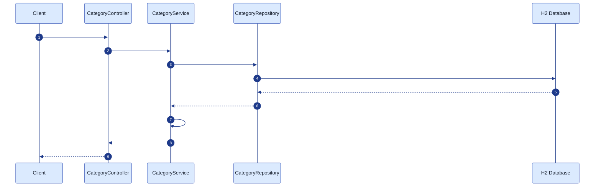
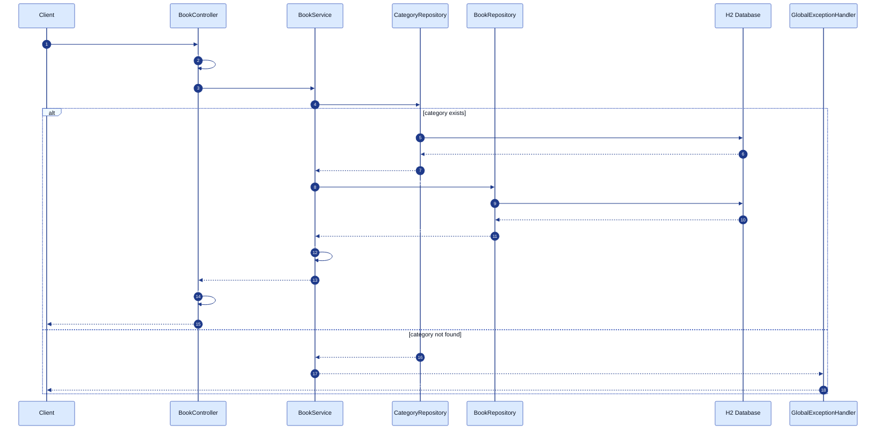

# Technical Design: Category Browsing

| Field | Value |
|---|---|
| **Feature ID** | FEAT-02 |
| **Corresponds To Spec** | [feature-02-category-browsing.md](../specs/feature-02-category-browsing.md) |
| **Corresponds To Plan** | [feature-02-category-browsing-plan.md](../plans/feature-02-category-browsing-plan.md) |
| **Status** | Draft — Awaiting Developer Approval |
| **Author** | AI Assistant (drafted for review) |

---

## 1. Purpose of This Document

This document translates the approved Plan into a **code-ready design**. Every open decision from the Plan (D-01 through D-05) is answered here. After you approve this design, the Coding stage should be mechanical — no more architectural thinking required.

---

## 2. Traceability

This design implements:

- Every requirement in [spec §3, §5, §6, §7](../specs/feature-02-category-browsing.md).
- Every phase and file listed in [plan §4, §5](../plans/feature-02-category-browsing-plan.md).

---

## 3. Overview

This feature adds a `Category` entity to the system, upgrades `Book` from a plain-string category field to a `@ManyToOne` relationship, seeds categories from `books.json`, and exposes two new REST endpoints:

- `GET /api/categories` — alphabetical list of all categories with book counts.
- `GET /api/books?category={slug}` — extends the existing books endpoint with an optional category filter.

No new dependencies are added to `pom.xml`. All changes are purely within the existing Spring Boot stack.

---

## 4. Architecture — Layer Diagram

```mermaid
%%{init: {'theme':'base','themeVariables':{'background':'#ffffff','primaryColor':'#dbeafe','primaryBorderColor':'#1e40af','primaryTextColor':'#0b1220','secondaryColor':'#fef9c3','tertiaryColor':'#dcfce7','lineColor':'#1e3a8a','edgeLabelBackground':'#ffffff','fontSize':'15px'}}}%%
flowchart LR
    Client([Client\nBrowser / Postman])

    subgraph Controllers
        BC[BookController]
        CC[CategoryController]
    end

    subgraph Services
        BS[BookService]
        CS[CategoryService]
    end

    subgraph Repositories
        BR[BookRepository]
        CR[CategoryRepository]
    end

    subgraph Entities
        B[(Book)]
        C[(Category)]
    end

    EH[GlobalExceptionHandler]
    SL[BookSeedLoader]

    Client -->|GET /api/books?category=...| BC
    Client -->|GET /api/categories| CC
    BC --> BS
    CC --> CS
    BS --> BR
    CS --> CR
    BR -->|SQL + JOIN| B
    CR -->|SQL| C
    B -->|@ManyToOne| C

    BC -.throws.-> EH
    CC -.throws.-> EH
    BS -.throws CategoryNotFoundException.-> EH
    EH -.404 / 400 JSON.-> Client

    SL -->|1. save Categories| CR
    SL -->|2. save Books| BR
```

**Key points:**
- `Book` now holds a `@ManyToOne` reference to `Category` — the FK `category_id` on the `book` table points to `category.id`.
- `BookSeedLoader` seeds categories **first**, then books. Order matters because books reference categories via a FK.
- `CategoryController` is a new, independent controller — it does not share code with `BookController`.

---

## 5. Request Flow — Sequence Diagrams

### 5.1 List all categories (`GET /api/categories`)



### 5.2 List books filtered by category (`GET /api/books?category=fiction`)



---

## 6. Data Model

### 6.1 The `category` table (new)

```sql
CREATE TABLE category (
    id    BIGINT       NOT NULL AUTO_INCREMENT PRIMARY KEY,
    name  VARCHAR(100) NOT NULL UNIQUE,   -- e.g. "Fiction", "Self-Help"
    slug  VARCHAR(100) NOT NULL UNIQUE    -- e.g. "fiction", "self-help"
);

CREATE INDEX idx_category_slug ON category(slug);
```

### 6.2 The `book` table (modified)

The `category VARCHAR(100)` column from FEAT-01 is **replaced** by a foreign key:

```sql
-- FEAT-01 column removed:
-- category VARCHAR(100) NOT NULL

-- FEAT-02 column added:
category_id BIGINT NOT NULL,
FOREIGN KEY (category_id) REFERENCES category(id)
```

Because we use `ddl-auto=create-drop` with H2, there is no migration script — Hibernate re-creates the entire schema from the entity annotations on every startup. The seed loader re-populates all data fresh each time.

### 6.3 `bookCount` — not a stored column

`bookCount` is **computed at query time** via a `COUNT` aggregate — it is never stored as a column on `category`. This keeps the data automatically consistent: if the seed adds more books to a category, the count is correct without any extra update step.

Resolves **D-02**.

---

## 7. Entity Design — `Category.java`

Location: `backend/src/main/java/com/harsh/bookstore/entity/Category.java`

```java
package com.harsh.bookstore.entity;

import jakarta.persistence.Column;
import jakarta.persistence.Entity;
import jakarta.persistence.GeneratedValue;
import jakarta.persistence.GenerationType;
import jakarta.persistence.Id;
import jakarta.persistence.Table;

@Entity
@Table(name = "category")
public class Category {

    @Id
    @GeneratedValue(strategy = GenerationType.IDENTITY)
    private Long id;

    @Column(nullable = false, unique = true, length = 100)
    private String name;    // "Fiction", "Self-Help", "Technology" …

    @Column(nullable = false, unique = true, length = 100)
    private String slug;    // "fiction", "self-help", "technology" …

    public Category() {}

    // Getters and setters for id, name, slug
    public Long getId() { return id; }
    public void setId(Long id) { this.id = id; }

    public String getName() { return name; }
    public void setName(String name) { this.name = name; }

    public String getSlug() { return slug; }
    public void setSlug(String slug) { this.slug = slug; }

    @Override
    public boolean equals(Object o) {
        if (this == o) return true;
        if (!(o instanceof Category)) return false;
        Category that = (Category) o;
        return id != null && id.equals(that.id);
    }

    @Override
    public int hashCode() { return getClass().hashCode(); }

    @Override
    public String toString() {
        return "Category{id=" + id + ", slug='" + slug + "'}";
    }
}
```

**Learning notes:**
- No `@OneToMany books` on this side — we never navigate from Category to its Books in this feature. Adding that would force loading all books whenever a Category is loaded, which is wasteful. Resolves **D-01**.
- `slug` is `UNIQUE` — no two categories can share the same URL-safe identifier.

---

## 8. Updated Entity — `Book.java` (modified field only)

The single change to `Book.java` is replacing:

```java
// BEFORE (FEAT-01)
@Column(nullable = false, length = 100)
private String category;
```

with:

```java
// AFTER (FEAT-02)
@ManyToOne(fetch = FetchType.EAGER)
@JoinColumn(name = "category_id", nullable = false)
private Category category;
```

**And update `toDto()` in `BookService`:**

```java
// BEFORE
dto.setCategory(book.getCategory());

// AFTER — expose the category name string (DTO shape is unchanged)
dto.setCategory(book.getCategory().getName());
```

The `BookDto.category` field remains a `String` — the DTO shape seen by API clients **does not change**. This is the key benefit of the DTO layer: the internal model changes, but the public API contract stays the same.

**Why `FetchType.EAGER`** (resolves **D-01**):
Every endpoint that returns a Book also returns its category name. Eager loading means the category is fetched in the same query as the book — one SQL JOIN, not a second round-trip. This is correct for a `@ManyToOne` with a single related row.

---

## 9. Repository Design — `CategoryRepository.java`

Location: `backend/src/main/java/com/harsh/bookstore/repository/CategoryRepository.java`

```java
package com.harsh.bookstore.repository;

import com.harsh.bookstore.entity.Category;
import org.springframework.data.jpa.repository.JpaRepository;
import org.springframework.data.jpa.repository.Query;
import org.springframework.stereotype.Repository;

import java.util.List;
import java.util.Optional;

@Repository
public interface CategoryRepository extends JpaRepository<Category, Long> {

    /**
     * Case-insensitive slug lookup.
     * Spring Data generates: WHERE LOWER(slug) = LOWER(?1)
     */
    Optional<Category> findBySlugIgnoreCase(String slug);

    /**
     * All categories ordered alphabetically, each with its book count.
     *
     * Returns Object[] rows: [Category, Long bookCount]
     * The service unpacks these into CategoryDto.
     *
     * COUNT(b.id) — counts non-null book ids (excludes categories with no books,
     * which would have null book ids from the LEFT JOIN, giving count = 0).
     */
    @Query("SELECT c, COUNT(b.id) FROM Category c " +
           "LEFT JOIN Book b ON b.category = c " +
           "GROUP BY c " +
           "ORDER BY c.name ASC")
    List<Object[]> findAllWithBookCount();
}
```

**Also update `BookRepository.java`** — add one method:

```java
import org.springframework.data.domain.Page;
import org.springframework.data.domain.Pageable;

// Add to BookRepository:
Page<Book> findByCategory(Category category, Pageable pageable);
```

Spring Data generates: `SELECT * FROM book WHERE category_id = ? ORDER BY ... LIMIT ? OFFSET ?`

---

## 10. Service Design

### 10.1 `CategoryService.java` (new)

Location: `backend/src/main/java/com/harsh/bookstore/service/CategoryService.java`

```java
package com.harsh.bookstore.service;

import com.harsh.bookstore.dto.CategoryDto;
import com.harsh.bookstore.entity.Category;
import com.harsh.bookstore.exception.CategoryNotFoundException;
import com.harsh.bookstore.repository.CategoryRepository;
import org.springframework.stereotype.Service;

import java.util.List;

@Service
public class CategoryService {

    private final CategoryRepository categoryRepository;

    public CategoryService(CategoryRepository categoryRepository) {
        this.categoryRepository = categoryRepository;
    }

    /**
     * Returns all categories alphabetically, each with its book count.
     */
    public List<CategoryDto> listAllCategories() {
        List<Object[]> rows = categoryRepository.findAllWithBookCount();
        return rows.stream()
                   .map(row -> toDto((Category) row[0], (Long) row[1]))
                   .toList();
    }

    /**
     * Looks up a Category by slug (case-insensitive).
     * @throws CategoryNotFoundException if no category has that slug.
     */
    public Category getCategoryBySlug(String slug) {
        return categoryRepository.findBySlugIgnoreCase(slug)
               .orElseThrow(() -> new CategoryNotFoundException(slug));
    }

    // --- private helpers ---

    private CategoryDto toDto(Category category, Long bookCount) {
        CategoryDto dto = new CategoryDto();
        dto.setId(category.getId());
        dto.setName(category.getName());
        dto.setSlug(category.getSlug());
        dto.setBookCount(bookCount);
        return dto;
    }
}
```

### 10.2 `BookService.java` (modified — add one method)

Add `listBooksByCategory` alongside the existing `listBooks` and `getBookById` methods:

```java
// Inject CategoryService via constructor alongside BookRepository
private final CategoryService categoryService;

public BookService(BookRepository bookRepository, CategoryService categoryService) {
    this.bookRepository = bookRepository;
    this.categoryService = categoryService;
}

/**
 * Returns a paginated page of books in the given category.
 * @throws CategoryNotFoundException if the slug does not match any category.
 */
public Page<BookDto> listBooksByCategory(String slug, int page, int size) {
    Category category = categoryService.getCategoryBySlug(slug);  // throws if not found
    PageRequest pageRequest = PageRequest.of(
        page, size, Sort.by("createdAt").descending()
    );
    return bookRepository.findByCategory(category, pageRequest).map(this::toDto);
}
```

The existing `listBooks(int page, int size)` and `getBookById(Long id)` methods are **unchanged**.

---

## 11. DTO Design — `CategoryDto.java` (new)

Location: `backend/src/main/java/com/harsh/bookstore/dto/CategoryDto.java`

```java
package com.harsh.bookstore.dto;

public class CategoryDto {

    private Long id;
    private String name;       // "Fiction"
    private String slug;       // "fiction"
    private long bookCount;    // number of books in this category

    public CategoryDto() {}

    // Getters and setters for id, name, slug, bookCount
    public Long getId() { return id; }
    public void setId(Long id) { this.id = id; }

    public String getName() { return name; }
    public void setName(String name) { this.name = name; }

    public String getSlug() { return slug; }
    public void setSlug(String slug) { this.slug = slug; }

    public long getBookCount() { return bookCount; }
    public void setBookCount(long bookCount) { this.bookCount = bookCount; }
}
```

Resolves **D-03** — `id` is included so that clients that want to pass a stable numeric key can, but slug is the recommended identifier for URL usage.

---

## 12. API Design

### 12.1 Endpoints

| # | Method | Path | Purpose |
|---|---|---|---|
| E1 | `GET` | `/api/categories` | List all categories with book counts |
| E2 | `GET` | `/api/books?category={slug}` | Books filtered by category (extends FEAT-01 E1) |

### 12.2 E1 — List categories

**Request**
```http
GET /api/categories
```
No query parameters.

**Response — 200 OK**
```json
[
  { "id": 1, "name": "Biography",   "slug": "biography",   "bookCount": 13 },
  { "id": 2, "name": "Business",    "slug": "business",    "bookCount": 14 },
  { "id": 3, "name": "Fiction",     "slug": "fiction",     "bookCount": 15 },
  { "id": 4, "name": "History",     "slug": "history",     "bookCount": 14 },
  { "id": 5, "name": "Philosophy",  "slug": "philosophy",  "bookCount": 12 },
  { "id": 6, "name": "Science",     "slug": "science",     "bookCount": 13 },
  { "id": 7, "name": "Self-Help",   "slug": "self-help",   "bookCount": 13 },
  { "id": 8, "name": "Technology",  "slug": "technology",  "bookCount": 14 }
]
```

### 12.3 E2 — Books filtered by category

**Request**
```http
GET /api/books?category=fiction&page=0&size=12
```

| Query param | Type | Default | Constraints |
|---|---|---|---|
| `category` | string (slug) | `null` (absent = all books) | Case-insensitive. Unknown slug → 404. |
| `page` | integer | `0` | ≥ 0 |
| `size` | integer | `12` | 1–100 |

**Response — 200 OK** — same `PagedResponse<BookDto>` shape as FEAT-01. No change to the response body structure.

**Response — 404 Not Found** (unknown category slug):
```json
{
  "timestamp": "2026-08-24T11:00:00.000",
  "status": 404,
  "error": "Not Found",
  "message": "Category with slug 'unknown-slug' was not found",
  "path": "/api/books"
}
```

### 12.4 `CategoryController.java` (new)

Location: `backend/src/main/java/com/harsh/bookstore/controller/CategoryController.java`

```java
package com.harsh.bookstore.controller;

import com.harsh.bookstore.dto.CategoryDto;
import com.harsh.bookstore.service.CategoryService;
import org.springframework.web.bind.annotation.GetMapping;
import org.springframework.web.bind.annotation.RequestMapping;
import org.springframework.web.bind.annotation.RestController;

import java.util.List;

@RestController
@RequestMapping("/api/categories")
public class CategoryController {

    private final CategoryService categoryService;

    public CategoryController(CategoryService categoryService) {
        this.categoryService = categoryService;
    }

    @GetMapping
    public List<CategoryDto> listCategories() {
        return categoryService.listAllCategories();
    }
}
```

### 12.5 `BookController.java` (modified `listBooks` only)

```java
@GetMapping
public PagedResponse<BookDto> listBooks(
        @RequestParam(defaultValue = "0")  int page,
        @RequestParam(defaultValue = "12") int size,
        @RequestParam(required = false)    String category) {   // NEW

    if (page < 0) throw new IllegalArgumentException("page must be >= 0");
    if (size < 1 || size > 100) throw new IllegalArgumentException("size must be between 1 and 100");

    Page<BookDto> result = (category != null)
        ? bookService.listBooksByCategory(category, page, size)  // NEW branch
        : bookService.listBooks(page, size);                      // existing behaviour

    return PagedResponse.from(result);
}
```

---

## 13. Error Handling

### 13.1 `CategoryNotFoundException.java` (new)

Location: `backend/src/main/java/com/harsh/bookstore/exception/CategoryNotFoundException.java`

```java
package com.harsh.bookstore.exception;

public class CategoryNotFoundException extends RuntimeException {
    public CategoryNotFoundException(String slug) {
        super("Category with slug '" + slug + "' was not found");
    }
}
```

### 13.2 `GlobalExceptionHandler.java` (add one handler)

Add alongside the existing `handleNotFound` for `BookNotFoundException`:

```java
@ExceptionHandler(CategoryNotFoundException.class)
public ResponseEntity<ErrorResponse> handleCategoryNotFound(
        CategoryNotFoundException ex, HttpServletRequest request) {
    ErrorResponse body = new ErrorResponse(
        HttpStatus.NOT_FOUND.value(),
        HttpStatus.NOT_FOUND.getReasonPhrase(),
        ex.getMessage(),
        request.getRequestURI()
    );
    return ResponseEntity.status(HttpStatus.NOT_FOUND).body(body);
}
```

---

## 14. Seed Loader Design — `BookSeedLoader.java` (modified)

The seed loader must create `Category` rows **before** saving `Book` rows that reference them.

**Slug derivation algorithm** (resolves **D-04**):

```java
private String toSlug(String name) {
    return name.toLowerCase().replaceAll("[^a-z0-9]+", "-").replaceAll("-+$", "");
}
// "Self-Help"  → "self-help"
// "Biography"  → "biography"
// "Technology" → "technology"
```

**Modified `run()` method structure:**

```java
@Override
public void run(String... args) throws Exception {
    if (bookRepository.count() > 0) {
        log.info("Books already present — skipping seed");
        return;
    }

    File file = new File(seedFilePath);
    if (!file.exists()) {
        log.warn("Seed file not found at {} — starting with empty catalogue",
                 file.getAbsolutePath());
        return;
    }

    ObjectMapper mapper = new ObjectMapper()
        .configure(DeserializationFeature.FAIL_ON_UNKNOWN_PROPERTIES, false);

    // Step 1 — read raw JSON as List<Map> to extract category names
    List<Map<String, Object>> rawBooks = mapper.readValue(
        file, new TypeReference<List<Map<String, Object>>>() {}
    );

    // Step 2 — collect distinct category names and save Category entities
    Map<String, Category> categoryByName = new LinkedHashMap<>();
    for (Map<String, Object> raw : rawBooks) {
        String name = (String) raw.get("category");
        if (name != null && !categoryByName.containsKey(name)) {
            Category cat = new Category();
            cat.setName(name);
            cat.setSlug(toSlug(name));
            categoryByName.put(name, categoryRepository.save(cat));
        }
    }
    log.info("Seeded {} categories", categoryByName.size());

    // Step 3 — build Book entities, resolving each category by name
    List<Book> books = new ArrayList<>();
    for (Map<String, Object> raw : rawBooks) {
        Book book = mapper.convertValue(raw, Book.class);
        String catName = (String) raw.get("category");
        book.setCategory(categoryByName.get(catName));
        books.add(book);
    }

    // Step 4 — bulk save books
    bookRepository.saveAll(books);
    log.info("Seeded {} books from {}", books.size(), file.getAbsolutePath());
}
```

**Why read raw JSON as `Map` first (not `Book`):** When Jackson reads `books.json` as a `List<Book>`, it tries to deserialise the `"category": "Fiction"` string into a `Category` object — and fails because `Category` has no string constructor. Reading as `Map<String, Object>` avoids that problem and lets us control the category lookup manually.

The `CategoryRepository` must be injected alongside `BookRepository`:

```java
private final BookRepository bookRepository;
private final CategoryRepository categoryRepository;

public BookSeedLoader(BookRepository bookRepository,
                      CategoryRepository categoryRepository) {
    this.bookRepository = bookRepository;
    this.categoryRepository = categoryRepository;
}
```

---

## 15. Testing Strategy

| Layer | Test Class | Annotation | Key Cases |
|---|---|---|---|
| Repository | `CategoryRepositoryTest` | `@DataJpaTest` | `findBySlugIgnoreCase` finds "fiction"; returns empty for unknown slug; `findAllWithBookCount` returns correct counts |
| Repository | `BookRepositoryTest` (modified) | `@DataJpaTest` | `findByCategory` returns only books for that category; unknown category → empty page |
| Service | `CategoryServiceTest` | Mockito only | `listAllCategories` returns alphabetical DTOs with counts; `getCategoryBySlug` throws `CategoryNotFoundException` for unknown slug |
| Service | `BookServiceTest` (modified) | Mockito only | `listBooksByCategory` delegates to repo correctly; propagates `CategoryNotFoundException` |
| Controller | `CategoryControllerTest` | `@WebMvcTest` | `GET /api/categories` → 200 with correct JSON array |
| Controller | `BookControllerTest` (modified) | `@WebMvcTest` | `?category=fiction` → 200; `?category=nope` → 404; no `category` param → same as FEAT-01 (regression guard) |

### Sample test cases

**Repository:**
```java
@Test
void findBySlugIgnoreCase_isCaseInsensitive() {
    Category c = new Category();
    c.setName("Fiction"); c.setSlug("fiction");
    categoryRepository.save(c);

    assertThat(categoryRepository.findBySlugIgnoreCase("FICTION")).isPresent();
    assertThat(categoryRepository.findBySlugIgnoreCase("Fiction")).isPresent();
    assertThat(categoryRepository.findBySlugIgnoreCase("fiction")).isPresent();
}
```

**Service:**
```java
@Test
void getCategoryBySlug_throwsCategoryNotFoundException_forUnknownSlug() {
    when(categoryRepository.findBySlugIgnoreCase("nope"))
        .thenReturn(Optional.empty());

    assertThatThrownBy(() -> categoryService.getCategoryBySlug("nope"))
        .isInstanceOf(CategoryNotFoundException.class)
        .hasMessageContaining("nope");
}
```

**Controller:**
```java
@Test
void listBooks_returns404_whenCategoryUnknown() throws Exception {
    when(bookService.listBooksByCategory(eq("nope"), anyInt(), anyInt()))
        .thenThrow(new CategoryNotFoundException("nope"));

    mockMvc.perform(get("/api/books?category=nope"))
        .andExpect(status().isNotFound())
        .andExpect(jsonPath("$.status").value(404))
        .andExpect(jsonPath("$.message").value("Category with slug 'nope' was not found"));
}

@Test
void listBooks_noCategory_behavesIdenticallyToFeat01() throws Exception {
    // regression guard — no category param must call bookService.listBooks not listBooksByCategory
    Page<BookDto> page = new PageImpl<>(List.of());
    when(bookService.listBooks(0, 12)).thenReturn(page);

    mockMvc.perform(get("/api/books"))
        .andExpect(status().isOk());

    verify(bookService).listBooks(0, 12);
    verify(bookService, never()).listBooksByCategory(any(), anyInt(), anyInt());
}
```

---

## 16. Decisions Resolved

| ID | Decision | Answer | Rationale |
|---|---|---|---|
| **D-01** | `@ManyToOne` fetch strategy on `Book.category` | `FetchType.EAGER` | Every book response includes its category name. EAGER loads it in the same JOIN — no second query. Correct for a single `@ManyToOne` row. |
| **D-02** | How `bookCount` is computed | `@Query` with `LEFT JOIN` + `COUNT(b.id)` in `CategoryRepository` | Computed at query time — always consistent. Zero overhead at our data scale. |
| **D-03** | `CategoryDto` shape | `{ id, name, slug, bookCount }` | Includes `id` for clients that need it; `slug` is the URL-safe identifier; `bookCount` satisfies spec FR-01. |
| **D-04** | Slug derivation algorithm | Lowercase + replace non-alphanumeric runs with `-` + trim trailing `-` | Deterministic. "Self-Help" → `"self-help"`. Handles all 8 category names correctly. |
| **D-05** | `BookController.listBooks()` branching | Single method with `if (category != null)` delegating to either `listBooks` or `listBooksByCategory` | Simplest possible branching. One method, two branches, easy to test each path independently. |

---

## 17. Review Checklist for the Developer

Before approving this design, please confirm:

- [ ] The Mermaid diagrams in §4 and §5 correctly show how categories flow through the system.
- [ ] The database schema change in §6 (replacing `category VARCHAR` with `category_id FK`) is understood.
- [ ] The `Category` entity in §7 has the right fields.
- [ ] The `Book` entity change in §8 (`@ManyToOne` + `FetchType.EAGER`) is understood.
- [ ] The `CategoryRepository` JPQL query in §9 for book counts is clear.
- [ ] The `CategoryService` and `BookService` changes in §10 make sense.
- [ ] The `CategoryDto` shape in §11 (`id`, `name`, `slug`, `bookCount`) is correct.
- [ ] The API examples in §12 are the JSON shape you expect.
- [ ] The `BookSeedLoader` changes in §14 — reading as `Map` first, saving categories before books — are understood.
- [ ] The testing strategy in §15 covers the right cases.
- [ ] Every answer in §16 is one you agree with.

Once approved, this design becomes the direct input to the **Coding stage** for FEAT-02.
