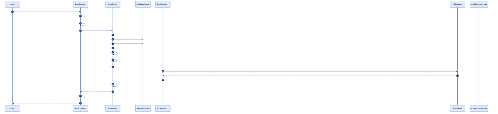

# Technical Design: Search & Filter

| Field | Value |
|---|---|
| **Feature ID** | FEAT-03 |
| **Corresponds To Spec** | [feature-03-search-and-filter.md](../specs/feature-03-search-and-filter.md) |
| **Corresponds To Plan** | [feature-03-search-and-filter-plan.md](../plans/feature-03-search-and-filter-plan.md) |
| **Status** | Draft — Awaiting Developer Approval |
| **Author** | AI Assistant (drafted for review) |

---

## 1. Purpose of This Document

This document translates the approved Plan into a **code-ready design**. Every open decision from the Plan (D-01 through D-05) is answered here. After you approve this design, the Coding stage should be mechanical — no more architectural thinking required.

---

## 2. Traceability

This design implements:

- Every requirement in [spec §3, §6, §7](../specs/feature-03-search-and-filter.md).
- Every phase and file listed in [plan §4, §5](../plans/feature-03-search-and-filter-plan.md).

---

## 3. Overview

This feature extends the existing `GET /api/books` endpoint with optional search and filter parameters. No new endpoints, no new entities, no new dependencies.

The key technique is **JPA Specifications**: each filter (keyword, category, price range, availability) is a small independent predicate object. The controller assembles a `BookFilter` value object from the request parameters, passes it to the service, and the service combines the active predicates into a single dynamic SQL `WHERE` clause.

---

## 4. Architecture — Layer Diagram

```mermaid
%%{init: {'theme':'base','themeVariables':{'background':'#ffffff','primaryColor':'#dbeafe','primaryBorderColor':'#1e40af','primaryTextColor':'#0b1220','secondaryColor':'#fef9c3','tertiaryColor':'#dcfce7','lineColor':'#1e3a8a','edgeLabelBackground':'#ffffff','fontSize':'15px'}}}%%
flowchart LR
    Client([Client\nBrowser / Postman])
    Ctrl[BookController]
    Filter[BookFilter\nvalue object]
    Svc[BookService]
    Spec[BookSpecification\nstatic factory]
    Repo[BookRepository\nJpaSpecificationExecutor]
    DB[(H2 Database)]
    EH[GlobalExceptionHandler]

    Client -->|GET /api/books?q=...&category=...&...| Ctrl
    Ctrl -->|validate params| Ctrl
    Ctrl -->|build| Filter
    Ctrl --> Svc
    Svc -->|reads| Filter
    Svc -->|build predicates| Spec
    Svc -->|findAll(spec, pageable)| Repo
    Repo -->|dynamic WHERE clause| DB
    DB -->|rows| Repo
    Repo -->|Page<Book>| Svc
    Svc -->|map to Page<BookDto>| Ctrl
    Ctrl -->|PagedResponse JSON| Client
    Ctrl -.IllegalArgumentException.-> EH
    EH -.400 JSON.-> Client
```

**Key points:**
- `BookFilter` is a pure data object — no Spring annotations, no JPA. It just carries the request parameters.
- `BookSpecification` is a utility class of static methods — each returns a `Specification<Book>` predicate (or `null` when the filter is absent).
- `BookRepository` gains `JpaSpecificationExecutor<Book>` — a one-line addition that unlocks `findAll(Specification, Pageable)`.
- No new controllers, no new entities, no new exceptions.

---

## 5. Request Flow — Sequence Diagram



---

## 6. `BookFilter` Value Object (new)

Location: `backend/src/main/java/com/harsh/bookstore/dto/BookFilter.java`

Resolves **D-03** — `BookFilter` is a plain Java class (not a record) for maximum readability and compatibility with the no-Lombok rule.

```java
package com.harsh.bookstore.dto;

import java.math.BigDecimal;

/**
 * Carries all optional search and filter parameters from an HTTP request.
 * All fields are nullable — null means "no constraint for this field".
 *
 * This is a pure data-holder. No business logic, no Spring annotations.
 */
public class BookFilter {

    /** Keyword to match against title, authors, description, isbn. Null = no keyword filter. */
    private String q;

    /** Category slug to filter by. Null = all categories. */
    private String categorySlug;

    /** Minimum price (inclusive). Null = no lower bound. */
    private BigDecimal minPrice;

    /** Maximum price (inclusive). Null = no upper bound. */
    private BigDecimal maxPrice;

    /** When true, only books with stockQuantity > 0 are returned. */
    private boolean availableOnly;

    /**
     * Sort order. One of: "newest" (default), "price_asc", "price_desc".
     * Null is treated as "newest".
     */
    private String sort;

    public BookFilter() {}

    // Getters and setters for all fields
    public String getQ() { return q; }
    public void setQ(String q) { this.q = q; }

    public String getCategorySlug() { return categorySlug; }
    public void setCategorySlug(String categorySlug) { this.categorySlug = categorySlug; }

    public BigDecimal getMinPrice() { return minPrice; }
    public void setMinPrice(BigDecimal minPrice) { this.minPrice = minPrice; }

    public BigDecimal getMaxPrice() { return maxPrice; }
    public void setMaxPrice(BigDecimal maxPrice) { this.maxPrice = maxPrice; }

    public boolean isAvailableOnly() { return availableOnly; }
    public void setAvailableOnly(boolean availableOnly) { this.availableOnly = availableOnly; }

    public String getSort() { return sort; }
    public void setSort(String sort) { this.sort = sort; }
}
```

---

## 7. `BookSpecification` — Predicate Factory (new)

Location: `backend/src/main/java/com/harsh/bookstore/repository/BookSpecification.java`

Resolves **D-01** (keyword JOIN strategy) and **D-05** (authors join with `distinct`).

```java
package com.harsh.bookstore.repository;

import com.harsh.bookstore.entity.Book;
import jakarta.persistence.criteria.Join;
import jakarta.persistence.criteria.JoinType;
import org.springframework.data.jpa.domain.Specification;

import java.math.BigDecimal;

/**
 * Static factory methods — each returns one Specification<Book> predicate.
 *
 * Returning null when the input is absent is intentional and idiomatic:
 * Specification.where(null) produces no WHERE clause, so null predicates
 * are simply skipped when combined.
 */
public class BookSpecification {

    private BookSpecification() {}   // utility class — no instances

    /**
     * Keyword match across title, isbn, description, and authors.
     *
     * WHY distinct():
     *   The authors JOIN is a one-to-many (one book → many author rows).
     *   Without distinct, a book with 3 authors would appear 3 times in
     *   the result set — giving wrong counts and duplicate rows.
     *   CriteriaQuery.distinct(true) adds DISTINCT to the generated SQL.
     */
    public static Specification<Book> hasKeyword(String q) {
        if (q == null || q.isBlank()) return null;
        String pattern = "%" + q.toLowerCase() + "%";

        return (root, query, cb) -> {
            // Mark the query as distinct to avoid duplicates from the authors join
            query.distinct(true);

            // Join to book_authors (LEFT JOIN so books without authors still match)
            Join<Object, Object> authorsJoin = root.join("authors", JoinType.LEFT);

            return cb.or(
                cb.like(cb.lower(root.get("title")),       pattern),
                cb.like(cb.lower(root.get("isbn")),        pattern),
                cb.like(cb.lower(root.get("description")), pattern),
                cb.like(cb.lower(authorsJoin.as(String.class)), pattern)
            );
        };
    }

    /**
     * Category slug match (case-insensitive).
     * Joins to the category table and matches on slug.
     */
    public static Specification<Book> hasCategory(String slug) {
        if (slug == null || slug.isBlank()) return null;

        return (root, query, cb) ->
            cb.equal(
                cb.lower(root.get("category").get("slug")),
                slug.toLowerCase()
            );
        // Note: if the slug doesn't match any category, this predicate
        // produces 0 results (empty page) — it does NOT throw 404.
        // CategoryNotFoundException is only thrown by the ?category-only
        // path in BookService.listBooksByCategory (FEAT-02).
        // FEAT-03 treats an unknown category in a combined filter as
        // "no results" — consistent with FR-14 (zero results = 200).
    }

    /**
     * Minimum price filter (inclusive).
     */
    public static Specification<Book> hasPriceAtLeast(BigDecimal min) {
        if (min == null) return null;
        return (root, query, cb) ->
            cb.greaterThanOrEqualTo(root.get("price"), min);
    }

    /**
     * Maximum price filter (inclusive).
     */
    public static Specification<Book> hasPriceAtMost(BigDecimal max) {
        if (max == null) return null;
        return (root, query, cb) ->
            cb.lessThanOrEqualTo(root.get("price"), max);
    }

    /**
     * Availability filter — only books with stockQuantity > 0.
     */
    public static Specification<Book> isAvailable() {
        return (root, query, cb) ->
            cb.greaterThan(root.get("stockQuantity"), 0);
    }
}
```

**Learning notes:**

- A `Specification<T>` is a functional interface: `(Root<T> root, CriteriaQuery<?> query, CriteriaBuilder cb) -> Predicate`. The three parameters give you everything needed to express any SQL condition.
- `root.get("title")` navigates to the `title` field on `Book`. `root.get("category").get("slug")` navigates the `@ManyToOne` relationship to `Category`, then to its `slug` field — Hibernate generates a JOIN automatically.
- `cb.lower(...)` wraps the expression in SQL's `LOWER()` — this is how case-insensitive matching works without full-text search.
- `join("authors", JoinType.LEFT)` joins the `book_authors` element-collection table. `LEFT` ensures books with no authors still appear (though all our books have at least one author).

---

## 8. Updated `BookRepository.java`

One-line addition — add `JpaSpecificationExecutor<Book>` to the extends clause. Resolves plan D-03.

```java
@Repository
public interface BookRepository
        extends JpaRepository<Book, Long>,
                JpaSpecificationExecutor<Book> {   // ← NEW

    // FEAT-02 method (unchanged):
    Page<Book> findByCategory(Category category, Pageable pageable);
}
```

`JpaSpecificationExecutor` adds:
```java
Page<Book> findAll(Specification<Book> spec, Pageable pageable);
```

All existing methods (`findAll(Pageable)`, `findById`, `count`, `saveAll`) are **unchanged**.

---

## 9. Updated `BookService.java`

The existing `listBooks(int page, int size)` method is **replaced** by the unified `listBooks(BookFilter filter, int page, int size)`. The `listBooksByCategory` method (FEAT-02) and `getBookById` are **unchanged**.

Resolves **D-02** (`SortOption` as a `String` constant, not a separate enum — keeps the design simple) and **D-04** (unknown category slug in combined filter → zero results, not 404).

```java
// Allowed sort values (validated in BookController, not here)
private static final String SORT_NEWEST    = "newest";
private static final String SORT_PRICE_ASC = "price_asc";
private static final String SORT_PRICE_DESC = "price_desc";

/**
 * Unified list method — handles all combinations of filters.
 * When filter has all-null fields, behaviour is identical to FEAT-01 listBooks().
 */
public Page<BookDto> listBooks(BookFilter filter, int page, int size) {

    // Build the combined Specification — null predicates are no-ops
    Specification<Book> spec = Specification
        .where(BookSpecification.hasKeyword(filter.getQ()))
        .and(BookSpecification.hasCategory(filter.getCategorySlug()))
        .and(BookSpecification.hasPriceAtLeast(filter.getMinPrice()))
        .and(BookSpecification.hasPriceAtMost(filter.getMaxPrice()));

    if (filter.isAvailableOnly()) {
        spec = spec.and(BookSpecification.isAvailable());
    }

    // Determine sort order
    Sort sort = resolveSort(filter.getSort());
    PageRequest pageRequest = PageRequest.of(page, size, sort);

    return bookRepository.findAll(spec, pageRequest).map(this::toDto);
}

private Sort resolveSort(String sortParam) {
    if (sortParam == null || sortParam.equals(SORT_NEWEST)) {
        return Sort.by("createdAt").descending();
    }
    if (sortParam.equals(SORT_PRICE_ASC)) {
        return Sort.by("price").ascending();
    }
    // SORT_PRICE_DESC — controller has already validated it's one of the 3 values
    return Sort.by("price").descending();
}
```

**Existing methods remain exactly as written in FEAT-01 and FEAT-02:**
- `listBooksByCategory(String slug, int page, int size)` — unchanged
- `getBookById(Long id)` — unchanged
- `toDto(Book book)` — unchanged

---

## 10. Updated `BookController.java`

The `listBooks()` method gains new `@RequestParam`s and a validation block. All other controller methods are unchanged.

```java
@GetMapping
public PagedResponse<BookDto> listBooks(
        @RequestParam(defaultValue = "0")   int page,
        @RequestParam(defaultValue = "12")  int size,
        @RequestParam(required = false)     String q,
        @RequestParam(required = false)     String category,
        @RequestParam(required = false)     BigDecimal minPrice,
        @RequestParam(required = false)     BigDecimal maxPrice,
        @RequestParam(required = false)     Boolean available,
        @RequestParam(required = false)     String sort) {

    // --- Validation ---
    if (page < 0)
        throw new IllegalArgumentException("page must be >= 0");
    if (size < 1 || size > 100)
        throw new IllegalArgumentException("size must be between 1 and 100");
    if (q != null && q.isBlank())
        throw new IllegalArgumentException("q must not be blank when provided");
    if (minPrice != null && minPrice.compareTo(BigDecimal.ZERO) < 0)
        throw new IllegalArgumentException("minPrice must be >= 0");
    if (maxPrice != null && maxPrice.compareTo(BigDecimal.ZERO) <= 0)
        throw new IllegalArgumentException("maxPrice must be > 0");
    if (minPrice != null && maxPrice != null
            && minPrice.compareTo(maxPrice) > 0)
        throw new IllegalArgumentException("minPrice must be <= maxPrice");
    if (sort != null && !List.of("newest", "price_asc", "price_desc").contains(sort))
        throw new IllegalArgumentException(
            "sort must be one of: newest, price_asc, price_desc");

    // --- Build filter ---
    BookFilter filter = new BookFilter();
    filter.setQ(q);
    filter.setCategorySlug(category);
    filter.setMinPrice(minPrice);
    filter.setMaxPrice(maxPrice);
    filter.setAvailableOnly(Boolean.TRUE.equals(available));
    filter.setSort(sort);

    // --- Delegate ---
    return PagedResponse.from(bookService.listBooks(filter, page, size));
}
```

**Why `Boolean.TRUE.equals(available)`:** The `available` param is `Boolean` (boxed) — it can be `null` (not provided), `true`, or `false`. `Boolean.TRUE.equals(null)` returns `false` safely, without a NullPointerException.

**Regression guarantee:** When all filter params are absent, `BookFilter` has all-null fields. `Specification.where(null).and(null)...` produces no `WHERE` clause. `resolveSort(null)` returns `createdAt DESC`. The result is identical to the FEAT-01 response.

---

## 11. API Design

### 11.1 Extended `GET /api/books` — full parameter table

| Parameter | Type | Default | Constraints | Error if invalid |
|---|---|---|---|---|
| `page` | integer | `0` | ≥ 0 | 400 |
| `size` | integer | `12` | 1–100 | 400 |
| `q` | string | absent | Non-blank when present | 400 |
| `category` | string (slug) | absent | Case-insensitive; unknown slug → 0 results (not 404) | — |
| `minPrice` | decimal | absent | ≥ 0; ≤ maxPrice if both present | 400 |
| `maxPrice` | decimal | absent | > 0; ≥ minPrice if both present | 400 |
| `available` | boolean | absent | `true` or `false` | — |
| `sort` | string | absent (`newest`) | `newest`, `price_asc`, `price_desc` | 400 |

### 11.2 Request examples

```http
# Keyword search
GET /api/books?q=tolkien

# Category filter
GET /api/books?category=fiction

# Price range
GET /api/books?minPrice=200&maxPrice=500

# In-stock only
GET /api/books?available=true

# Sort by price ascending
GET /api/books?sort=price_asc

# Combined — all at once
GET /api/books?q=history&category=history&minPrice=300&available=true&sort=price_asc&page=0&size=12
```

### 11.3 Response — 200 OK

Same `PagedResponse<BookDto>` shape as FEAT-01. No change to the response body structure. Zero results:

```json
{
  "content": [],
  "page": 0,
  "size": 12,
  "totalElements": 0,
  "totalPages": 0,
  "hasNext": false,
  "hasPrevious": false
}
```

### 11.4 Response — 400 Bad Request examples

```json
{ "timestamp": "...", "status": 400, "error": "Bad Request",
  "message": "q must not be blank when provided", "path": "/api/books" }

{ "timestamp": "...", "status": 400, "error": "Bad Request",
  "message": "minPrice must be <= maxPrice", "path": "/api/books" }

{ "timestamp": "...", "status": 400, "error": "Bad Request",
  "message": "sort must be one of: newest, price_asc, price_desc", "path": "/api/books" }
```

All 400 errors use the existing `GlobalExceptionHandler` `IllegalArgumentException` handler — **no new exception class needed**.

---

## 12. Testing Strategy

| Layer | Test Class | Annotation | Key Cases |
|---|---|---|---|
| Repository / Spec | `BookSpecificationTest` | `@DataJpaTest` | Each predicate individually; combined predicates; distinct prevents duplicates on authors join |
| Service | `BookServiceTest` (modified) | Mockito only | All-null filter → no WHERE clause; keyword-only filter; combined filter; each sort option |
| Controller | `BookControllerTest` (modified) | `@WebMvcTest` | Each valid param → 200; blank `q` → 400; bad price range → 400; bad sort → 400; no params → same as FEAT-01 (regression); `?category=fiction` → same as FEAT-02 (regression) |

### Sample test cases

**Specification test (`@DataJpaTest`):**
```java
@Test
void hasKeyword_matchesTitle_caseInsensitive() {
    // seed a book with title "Clean Code"
    // apply hasKeyword("clean") spec
    // assert exactly that book is returned
}

@Test
void hasKeyword_doesNotReturnDuplicates_forBookWithMultipleAuthors() {
    // seed a book with 3 authors all matching the keyword
    // apply hasKeyword spec
    // assert the book appears exactly ONCE in results (not 3 times)
}

@Test
void combinedSpec_appliesAllPredicatesWithAndLogic() {
    // seed 4 books: only 1 matches keyword AND category AND price AND available
    // apply all 4 specs combined
    // assert exactly 1 book returned
}
```

**Service test (Mockito):**
```java
@Test
void listBooks_withAllNullFilter_callsFindAllWithNullSpec() {
    BookFilter filter = new BookFilter();  // all null
    when(bookRepository.findAll(any(Specification.class), any(Pageable.class)))
        .thenReturn(new PageImpl<>(List.of()));

    bookService.listBooks(filter, 0, 12);

    ArgumentCaptor<Pageable> pageCaptor = ArgumentCaptor.forClass(Pageable.class);
    verify(bookRepository).findAll(any(Specification.class), pageCaptor.capture());
    assertThat(pageCaptor.getValue().getSort().getOrderFor("createdAt"))
        .isNotNull();
    assertThat(pageCaptor.getValue().getSort().getOrderFor("createdAt").isDescending())
        .isTrue();
}

@Test
void listBooks_withPriceAscSort_buildsCorrectPageable() {
    BookFilter filter = new BookFilter();
    filter.setSort("price_asc");
    when(bookRepository.findAll(any(Specification.class), any(Pageable.class)))
        .thenReturn(new PageImpl<>(List.of()));

    bookService.listBooks(filter, 0, 12);

    ArgumentCaptor<Pageable> captor = ArgumentCaptor.forClass(Pageable.class);
    verify(bookRepository).findAll(any(), captor.capture());
    assertThat(captor.getValue().getSort().getOrderFor("price").isAscending()).isTrue();
}
```

**Controller test (`@WebMvcTest`):**
```java
@Test
void listBooks_returns400_whenQIsBlank() throws Exception {
    mockMvc.perform(get("/api/books?q="))
        .andExpect(status().isBadRequest())
        .andExpect(jsonPath("$.message")
            .value("q must not be blank when provided"));
}

@Test
void listBooks_returns400_whenMinPriceExceedsMaxPrice() throws Exception {
    mockMvc.perform(get("/api/books?minPrice=500&maxPrice=100"))
        .andExpect(status().isBadRequest())
        .andExpect(jsonPath("$.message")
            .value("minPrice must be <= maxPrice"));
}

@Test
void listBooks_returns400_whenSortInvalid() throws Exception {
    mockMvc.perform(get("/api/books?sort=invalid"))
        .andExpect(status().isBadRequest())
        .andExpect(jsonPath("$.message")
            .value("sort must be one of: newest, price_asc, price_desc"));
}

@Test
void listBooks_noParams_regressionGuard_behaviourMatchesFeat01() throws Exception {
    when(bookService.listBooks(any(BookFilter.class), eq(0), eq(12)))
        .thenReturn(new PageImpl<>(List.of()));

    mockMvc.perform(get("/api/books"))
        .andExpect(status().isOk());

    // Verify the filter passed to the service has all-null fields
    ArgumentCaptor<BookFilter> filterCaptor = ArgumentCaptor.forClass(BookFilter.class);
    verify(bookService).listBooks(filterCaptor.capture(), eq(0), eq(12));
    BookFilter captured = filterCaptor.getValue();
    assertThat(captured.getQ()).isNull();
    assertThat(captured.getCategorySlug()).isNull();
    assertThat(captured.getMinPrice()).isNull();
    assertThat(captured.getMaxPrice()).isNull();
    assertThat(captured.isAvailableOnly()).isFalse();
    assertThat(captured.getSort()).isNull();
}
```

---

## 13. Decisions Resolved

| ID | Decision | Answer | Rationale |
|---|---|---|---|
| **D-01** | Keyword LIKE across `authors` (join strategy) | `root.join("authors", JoinType.LEFT)` in `hasKeyword` + `query.distinct(true)` | LEFT JOIN includes books even if they have no authors. `distinct(true)` prevents duplicate rows when a book has multiple authors all matching the keyword. |
| **D-02** | `SortOption` — enum or String | String constants (`"newest"`, `"price_asc"`, `"price_desc"`) validated in the controller | Keeps the code simple. The controller validates the three values explicitly. An enum would add a class with minimal benefit at this scale. |
| **D-03** | `BookFilter` — record, builder, or plain class | Plain class with getters/setters | Consistent with the no-Lombok, no-record convention established in FEAT-01. Readable, testable, no magic. |
| **D-04** | Unknown category slug in combined filter | Returns zero results (200 empty page) — no 404 | Consistent with spec FR-14 ("zero results = 200"). Only the FEAT-02 `?category=` standalone branch in `listBooksByCategory` throws `CategoryNotFoundException`. In a combined search context, an unknown category is treated as an impossible filter — empty result, not an error. |
| **D-05** | Authors join — avoiding duplicate books | `query.distinct(true)` inside `hasKeyword` Specification | Adds SQL `DISTINCT` only when the keyword filter (which does the authors join) is active. Other predicates that don't join to authors don't need distinct and don't pay the cost. |

---

## 14. Review Checklist for the Developer

Before approving this design, please confirm:

- [ ] The sequence diagram in §5 clearly shows how `BookSpecification` predicates are assembled and combined.
- [ ] The `BookFilter` class in §6 has the right fields and all are nullable/defaulted correctly.
- [ ] The `BookSpecification` methods in §7 — especially the `distinct` fix for the authors join — are understood.
- [ ] The one-line `BookRepository` change in §8 (`JpaSpecificationExecutor`) is clear.
- [ ] The `BookService.listBooks(BookFilter, ...)` unified method in §9 makes sense — in particular, that all-null filter = FEAT-01 behaviour.
- [ ] The `BookController` validation block in §10 covers all the error cases from spec §7.
- [ ] The API table in §11 matches the spec's parameter list.
- [ ] The behaviour of unknown `category` slug in a combined filter (zero results, not 404) in D-04 is acceptable.
- [ ] The testing strategy in §12 covers regressions for FEAT-01 and FEAT-02 behaviour.
- [ ] Every answer in §13 is one you agree with.

Once approved, this design becomes the direct input to the **Coding stage** for FEAT-03.
