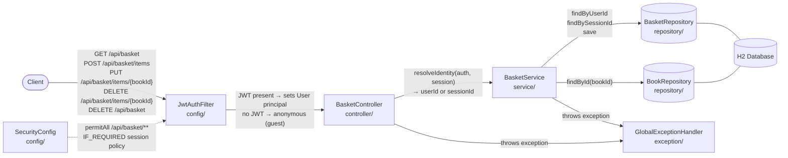

# Technical Design — FEAT-06: Shopping Basket

| Field | Value |
|---|---|
| **Feature ID** | FEAT-06 |
| **Spec** | [docs/specs/feature-06-shopping-basket.md](../specs/feature-06-shopping-basket.md) |
| **Plan** | [docs/plans/feature-06-shopping-basket-plan.md](../plans/feature-06-shopping-basket-plan.md) |
| **Status** | Draft — Awaiting Developer Approval |

---

## 1. Purpose

This document translates the approved plan into a **code-ready design**. Every class, method signature, annotation, and field is specified here. The coding phase should be mechanical — no architectural decisions left to make.

---

## 2. Architecture — Request Flow



---

## 3. Layer Responsibilities

| Layer | Class | Responsibility |
|---|---|---|
| Entity | `Basket` | Root basket row — owns the `items` collection; keyed by `userId` or `sessionId` |
| Entity | `BasketItem` | One book + quantity inside a basket |
| Repository | `BasketRepository` | `findByUserId`, `findBySessionId`, `deleteBySessionId` |
| Service | `BasketService` | All business rules: stock check, max-qty guard, add/update/remove/clear |
| Controller | `BasketController` | HTTP translation — 5 endpoints, extracts identity from `Authentication`/`HttpSession` |
| DTO | `BasketItemDto` | One line item in the basket API response |
| DTO | `BasketResponse` | Full basket response body |
| DTO | `AddItemRequest` | Request body for `POST /api/basket/items` |
| DTO | `UpdateItemRequest` | Request body for `PUT /api/basket/items/{bookId}` |
| Exception | `BasketItemNotFoundException` | Thrown when item not in basket → 404 |
| Exception | `OutOfStockException` | Thrown when book stock = 0 → 400 |
| Exception | `MaxQuantityExceededException` | Thrown when quantity > 7 → 400 |
| Config | `SecurityConfig` | Session policy changed to `IF_REQUIRED`; `/api/basket/**` added to `permitAll()` |
| Exception | `GlobalExceptionHandler` | 3 new handlers added for the 3 new exceptions |

---

## 4. No New Maven Dependencies

`HttpSession` is part of `jakarta.servlet` already on the classpath via `spring-boot-starter-web`. Spring Session (JDBC/Redis) is **not** used — the session is in-memory (per-JVM), which is sufficient for a dev/single-node setup. No `pom.xml` changes required.

---

## 5. Phase 1 — Entities

### 5.1 `entity/Basket.java`

```java
@Entity
@Table(name = "basket")
public class Basket {

    @Id
    @GeneratedValue(strategy = GenerationType.IDENTITY)
    private Long id;

    // Set for authenticated users; null for guests.
    @Column(name = "user_id")
    private Long userId;

    // Set for guest sessions; null for authenticated users.
    // Max length 128: HttpSession IDs are typically 32–64 hex chars.
    @Column(name = "session_id", length = 128)
    private String sessionId;

    @Column(name = "created_at", nullable = false, updatable = false)
    private LocalDateTime createdAt;

    // cascade = ALL so that saving the Basket also saves/deletes its items.
    // orphanRemoval = true so that removing an item from the list deletes the row.
    @OneToMany(mappedBy = "basket", cascade = CascadeType.ALL, orphanRemoval = true)
    private List<BasketItem> items = new ArrayList<>();

    @PrePersist
    protected void onCreate() {
        if (createdAt == null) createdAt = LocalDateTime.now();
    }

    // no-arg constructor + getters + setters
    // equals: id-based (same pattern as Book/User)
    // hashCode: getClass().hashCode()
    // toString: "Basket{id=..., userId=..., sessionId='...'}"
}
```

**Invariant:** exactly one of `userId` / `sessionId` is non-null per row. The service (`resolveBasket`) enforces this when creating new baskets — it never sets both.

### 5.2 `entity/BasketItem.java`

```java
@Entity
@Table(name = "basket_item")
public class BasketItem {

    @Id
    @GeneratedValue(strategy = GenerationType.IDENTITY)
    private Long id;

    // Many items can belong to one basket.
    @ManyToOne(fetch = FetchType.LAZY)
    @JoinColumn(name = "basket_id", nullable = false)
    private Basket basket;

    // Always want the full book data when loading an item (title, price, cover).
    @ManyToOne(fetch = FetchType.EAGER)
    @JoinColumn(name = "book_id", nullable = false)
    private Book book;

    @Column(nullable = false)
    private int quantity;

    // no-arg constructor + getters + setters
    // equals: id-based
    // hashCode: getClass().hashCode()
    // toString: "BasketItem{id=..., bookId=..., quantity=...}"
}
```

**Why `FetchType.EAGER` on `book`:** every time a basket item is loaded, it is immediately mapped to `BasketItemDto` (which needs `title`, `price`, `coverImageUrl`). Eager loading avoids a separate SELECT per item and never risks a `LazyInitializationException` in the mapping code.

**Why `FetchType.LAZY` on `basket`:** navigation from item → basket is never needed. Lazy avoids loading the whole parent basket when the item alone is in scope.

---

## 6. Phase 2 — Repository

### 6.1 `repository/BasketRepository.java`

```java
@Repository
public interface BasketRepository extends JpaRepository<Basket, Long> {

    Optional<Basket> findByUserId(Long userId);

    Optional<Basket> findBySessionId(String sessionId);

    void deleteBySessionId(String sessionId);
}
```

All three methods are derived-query names — Spring Data generates the SQL. `deleteBySessionId` is included for potential future cleanup jobs (not used directly in FEAT-06 business logic).

---

## 7. Phase 3 — Exceptions

### 7.1 `exception/BasketItemNotFoundException.java`

```java
public class BasketItemNotFoundException extends RuntimeException {

    public BasketItemNotFoundException(Long bookId) {
        super("Book " + bookId + " is not in your basket");
    }
}
```

→ handled by `GlobalExceptionHandler` → HTTP **404**.

### 7.2 `exception/OutOfStockException.java`

```java
public class OutOfStockException extends RuntimeException {

    public OutOfStockException() {
        super("This book is currently out of stock");
    }
}
```

→ handled by `GlobalExceptionHandler` → HTTP **400**. Message matches spec BR-04 / AC-04 exactly.

### 7.3 `exception/MaxQuantityExceededException.java`

```java
public class MaxQuantityExceededException extends RuntimeException {

    public MaxQuantityExceededException() {
        super("Maximum quantity per book is 7");
    }
}
```

→ handled by `GlobalExceptionHandler` → HTTP **400**. Message matches spec BR-05 / AC-05 exactly.

---

## 8. Phase 4 — DTOs

### 8.1 `dto/BasketItemDto.java`

```java
public class BasketItemDto {
    private Long bookId;
    private String title;
    private String author;          // first element of book.getAuthors(), or "" if empty
    private String coverImageUrl;
    private BigDecimal unitPrice;
    private int quantity;
    private BigDecimal lineTotal;   // unitPrice × quantity, computed in BasketService.toResponse()

    // no-arg constructor + getters + setters
}
```

### 8.2 `dto/BasketResponse.java`

```java
public class BasketResponse {
    private List<BasketItemDto> items;
    private int totalItems;          // sum of all item quantities
    private BigDecimal basketTotal;  // sum of all lineTotals

    // no-arg constructor + getters + setters
}
```

### 8.3 `dto/AddItemRequest.java`

```java
public class AddItemRequest {

    @NotNull(message = "bookId is required")
    private Long bookId;

    @Min(value = 1, message = "quantity must be at least 1")
    @Max(value = 7, message = "quantity must be at most 7")
    private int quantity = 1;   // default 1 if omitted from JSON

    // no-arg constructor + getters + setters
}
```

**Why `@Min(1)` and `@Max(7)` here:** Bean Validation handles the syntactic bounds before the service ever runs. The service's `MaxQuantityExceededException` is for the *aggregate* quantity check (existing + new > 7), which cannot be validated at the DTO level.

### 8.4 `dto/UpdateItemRequest.java`

```java
public class UpdateItemRequest {

    @Min(value = 0, message = "quantity must be 0 or greater")
    @Max(value = 7, message = "quantity must be at most 7")
    private int quantity;

    // no-arg constructor + getters + setters
}
```

`@Min(0)` allows zero (which triggers removal in the service per BR-07).

---

## 9. Phase 5 — Service

### 9.1 `service/BasketService.java` — full method specification

```java
@Service
public class BasketService {

    private final BasketRepository basketRepository;
    private final BookRepository bookRepository;

    public BasketService(BasketRepository basketRepository,
                         BookRepository bookRepository) { ... }

    // ------------------------------------------------------------------
    // PUBLIC API
    // ------------------------------------------------------------------

    public BasketResponse getBasket(Long userId, String sessionId) { ... }

    public BasketResponse addItem(Long userId, String sessionId,
                                  AddItemRequest req) { ... }

    public BasketResponse updateItem(Long userId, String sessionId,
                                     Long bookId, int quantity) { ... }

    public BasketResponse removeItem(Long userId, String sessionId,
                                     Long bookId) { ... }

    public BasketResponse clearBasket(Long userId, String sessionId) { ... }

    // ------------------------------------------------------------------
    // PRIVATE HELPERS
    // ------------------------------------------------------------------

    private Basket resolveBasket(Long userId, String sessionId) { ... }

    private BasketResponse toResponse(Basket basket) { ... }
}
```

#### `resolveBasket(Long userId, String sessionId)`

```
if userId != null:
    return basketRepository.findByUserId(userId)
           .orElseGet(() -> { Basket b = new Basket(); b.setUserId(userId); return basketRepository.save(b); })
else:
    return basketRepository.findBySessionId(sessionId)
           .orElseGet(() -> { Basket b = new Basket(); b.setSessionId(sessionId); return basketRepository.save(b); })
```

Creates a new, empty basket the first time a visitor calls any basket endpoint.

#### `addItem(Long userId, String sessionId, AddItemRequest req)`

```
1. basket = resolveBasket(userId, sessionId)
2. book   = bookRepository.findById(req.getBookId())
              .orElseThrow(() -> new BookNotFoundException(req.getBookId()))
3. if book.getStockQuantity() == 0 → throw new OutOfStockException()
4. existing = basket.getItems().stream()
                    .filter(i -> i.getBook().getId().equals(req.getBookId()))
                    .findFirst()
5. if existing.isPresent():
       newQty = existing.get().getQuantity() + req.getQuantity()
       if newQty > 7 → throw new MaxQuantityExceededException()
       existing.get().setQuantity(newQty)
   else:
       item = new BasketItem()
       item.setBasket(basket)
       item.setBook(book)
       item.setQuantity(req.getQuantity())
       basket.getItems().add(item)
6. basketRepository.save(basket)
7. return toResponse(basket)
```

#### `updateItem(Long userId, String sessionId, Long bookId, int quantity)`

```
1. basket = resolveBasket(userId, sessionId)
2. item   = basket.getItems().stream()
                  .filter(i -> i.getBook().getId().equals(bookId))
                  .findFirst()
                  .orElseThrow(() -> new BasketItemNotFoundException(bookId))
3. if quantity == 0:
       basket.getItems().remove(item)
   else:
       item.setQuantity(quantity)     // @Max(7) on DTO already guards quantity > 7
4. basketRepository.save(basket)
5. return toResponse(basket)
```

#### `removeItem(Long userId, String sessionId, Long bookId)`

```
1. basket = resolveBasket(userId, sessionId)
2. item   = basket.getItems().stream()
                  .filter(i -> i.getBook().getId().equals(bookId))
                  .findFirst()
                  .orElseThrow(() -> new BasketItemNotFoundException(bookId))
3. basket.getItems().remove(item)
4. basketRepository.save(basket)
5. return toResponse(basket)
```

#### `clearBasket(Long userId, String sessionId)`

```
1. basket = resolveBasket(userId, sessionId)
2. basket.getItems().clear()
3. basketRepository.save(basket)
4. return toResponse(basket)    // will be empty
```

#### `toResponse(Basket basket)`

```
items = basket.getItems().stream().map(item -> {
    book     = item.getBook()
    author   = book.getAuthors().isEmpty() ? "" : book.getAuthors().get(0)
    lineTotal = book.getPrice().multiply(BigDecimal.valueOf(item.getQuantity()))
    return new BasketItemDto(book.getId(), book.getTitle(), author,
                             book.getCoverImageUrl(), book.getPrice(),
                             item.getQuantity(), lineTotal)
}).toList()

totalItems   = items.stream().mapToInt(BasketItemDto::getQuantity).sum()
basketTotal  = items.stream()
                    .map(BasketItemDto::getLineTotal)
                    .reduce(BigDecimal.ZERO, BigDecimal::add)

return new BasketResponse(items, totalItems, basketTotal)
```

---

## 10. Phase 6 — Controller

### 10.1 `controller/BasketController.java`

```java
@RestController
@RequestMapping("/api/basket")
public class BasketController {

    private final BasketService basketService;

    public BasketController(BasketService basketService) { ... }

    @GetMapping
    public BasketResponse getBasket(Authentication authentication,
                                    HttpSession session) { ... }

    @PostMapping("/items")
    public BasketResponse addItem(@Valid @RequestBody AddItemRequest req,
                                  Authentication authentication,
                                  HttpSession session) { ... }

    @PutMapping("/items/{bookId}")
    public BasketResponse updateItem(@PathVariable Long bookId,
                                     @Valid @RequestBody UpdateItemRequest req,
                                     Authentication authentication,
                                     HttpSession session) { ... }

    @DeleteMapping("/items/{bookId}")
    public BasketResponse removeItem(@PathVariable Long bookId,
                                     Authentication authentication,
                                     HttpSession session) { ... }

    @DeleteMapping
    public BasketResponse clearBasket(Authentication authentication,
                                      HttpSession session) { ... }

    // ------------------------------------------------------------------
    // PRIVATE HELPER
    // ------------------------------------------------------------------

    /**
     * Extracts the identity key for basket resolution.
     *
     * If a valid JWT was present, JwtAuthFilter has already placed the
     * User entity as the Authentication principal. We cast and return the
     * userId. Otherwise the caller is a guest and we use the HttpSession id.
     *
     * The two-element array avoids a custom return type:
     *   result[0] = userId  (Long, nullable)
     *   result[1] = sessionId (String, nullable)
     * Exactly one is non-null.
     */
    private Object[] resolveIdentity(Authentication auth, HttpSession session) {
        if (auth != null && auth.getPrincipal() instanceof User user) {
            return new Object[]{ user.getId(), null };
        }
        return new Object[]{ null, session.getId() };
    }
}
```

**How `resolveIdentity` is called in each handler:**

```java
Object[] identity = resolveIdentity(authentication, session);
Long userId    = (Long)   identity[0];
String sessId  = (String) identity[1];
// then delegate to basketService.someMethod(userId, sessId, ...)
```

**Why `Authentication` is nullable:** Spring injects `null` when the request has no JWT (guest path). Because `/api/basket/**` is `permitAll()`, Spring Security does not block these requests — it simply doesn't set an `Authentication` in the context. The `instanceof User` pattern-match guard handles the null case cleanly.

**Why `HttpSession session` is always injected:** Spring MVC injects it and, with `IF_REQUIRED` session policy, creates an `HttpSession` the first time a guest touches a basket endpoint. For authenticated users, a session may or may not exist; calling `session.getId()` on an authenticated request is harmless — the `resolveIdentity` helper only uses `sessId` when `userId` is null.

---

## 11. Phase 7 — Security Config Changes

### 11.1 Session policy change

In [`SecurityConfig.securityFilterChain`](../../../backend/src/main/java/com/harsh/bookstore/config/SecurityConfig.java):

```java
// BEFORE
.sessionManagement(sm -> sm.sessionCreationPolicy(SessionCreationPolicy.STATELESS))

// AFTER
.sessionManagement(sm -> sm.sessionCreationPolicy(SessionCreationPolicy.IF_REQUIRED))
```

`IF_REQUIRED` means Spring creates an `HttpSession` only when one is actually needed — i.e., only when a guest calls a basket endpoint and none exists yet. All other authenticated requests (JWT-bearing) continue without any session.

### 11.2 Basket permit rule

Add to the `authorizeHttpRequests` block **before** the `anyRequest().authenticated()` catch-all:

```java
// Basket is open to guests and authenticated users alike (FEAT-06)
.requestMatchers("/api/basket/**").permitAll()
```

The full updated permit block becomes:

```java
.authorizeHttpRequests(auth -> auth
    .requestMatchers(HttpMethod.GET, "/api/books/**").permitAll()
    .requestMatchers(HttpMethod.GET, "/api/categories").permitAll()
    .requestMatchers(HttpMethod.POST, "/api/auth/**").permitAll()
    .requestMatchers("/h2-console/**").permitAll()
    .requestMatchers("/api/basket/**").permitAll()      // FEAT-06 addition
    .anyRequest().authenticated()
)
```

### 11.3 CSRF note

CSRF remains disabled (it was disabled for the stateless JWT design). Guest baskets use session cookies but CSRF is still safe to leave disabled here because:
1. The session is keyed only to a basket (no auth state is stored in the session).
2. An attacker tricking a browser into forging basket requests would only modify the victim's own anonymous basket — no financial or account harm is possible (checkout/payment is FEAT-07 scope, where CSRF must be re-evaluated).

---

## 12. Phase 8 — GlobalExceptionHandler Additions

Three new `@ExceptionHandler` methods added to `GlobalExceptionHandler`, following the exact same pattern as the existing handlers:

```java
// ================================================================
// FEAT-06 handlers
// ================================================================

/** 404 — requested book not in the caller's basket */
@ExceptionHandler(BasketItemNotFoundException.class)
public ResponseEntity<ErrorResponse> handleBasketItemNotFound(
        BasketItemNotFoundException ex, HttpServletRequest request) {

    ErrorResponse body = new ErrorResponse(
        HttpStatus.NOT_FOUND.value(),
        HttpStatus.NOT_FOUND.getReasonPhrase(),
        ex.getMessage(),
        request.getRequestURI()
    );
    return ResponseEntity.status(HttpStatus.NOT_FOUND).body(body);
}

/** 400 — book is out of stock */
@ExceptionHandler(OutOfStockException.class)
public ResponseEntity<ErrorResponse> handleOutOfStock(
        OutOfStockException ex, HttpServletRequest request) {

    ErrorResponse body = new ErrorResponse(
        HttpStatus.BAD_REQUEST.value(),
        HttpStatus.BAD_REQUEST.getReasonPhrase(),
        ex.getMessage(),
        request.getRequestURI()
    );
    return ResponseEntity.status(HttpStatus.BAD_REQUEST).body(body);
}

/** 400 — adding the book would push its basket quantity above 7 */
@ExceptionHandler(MaxQuantityExceededException.class)
public ResponseEntity<ErrorResponse> handleMaxQuantityExceeded(
        MaxQuantityExceededException ex, HttpServletRequest request) {

    ErrorResponse body = new ErrorResponse(
        HttpStatus.BAD_REQUEST.value(),
        HttpStatus.BAD_REQUEST.getReasonPhrase(),
        ex.getMessage(),
        request.getRequestURI()
    );
    return ResponseEntity.status(HttpStatus.BAD_REQUEST).body(body);
}
```

---

## 13. Test Designs

### 13.1 `BasketRepositoryTest` (`@DataJpaTest`)

Test class location: `src/test/java/com/harsh/bookstore/repository/BasketRepositoryTest.java`

| Test method | What it verifies |
|---|---|
| `findByUserId_returnsBasket` | Save a Basket with `userId=1L`; `findByUserId(1L)` returns it |
| `findBySessionId_returnsBasket` | Save a Basket with `sessionId="abc"`; `findBySessionId("abc")` returns it |
| `findByUserId_returnsEmpty_whenNotFound` | `findByUserId(999L)` on an empty table → `Optional.empty()` |

Setup: each test uses `@Autowired BasketRepository` and `@Autowired EntityManager`; `@Transactional` is provided by `@DataJpaTest`.

### 13.2 `BasketServiceTest` (`@ExtendWith(MockitoExtension.class)`)

Test class location: `src/test/java/com/harsh/bookstore/service/BasketServiceTest.java`

`@Mock BasketRepository basketRepository`
`@Mock BookRepository bookRepository`
Service instantiated directly in `@BeforeEach`.

| Test method | Scenario |
|---|---|
| `getBasket_emptyBasket` | `resolveBasket` creates a new Basket with empty items; `toResponse` returns `items=[], totalItems=0, basketTotal=0.00` |
| `addItem_success` | Book exists, stock > 0, qty=1, basket empty → item added; response has 1 item with correct `lineTotal` |
| `addItem_sameBookIncrementsQuantity` | Basket already has qty=2 for bookId=1; add qty=1 → item qty becomes 3 |
| `addItem_outOfStock_throws` | Book stock=0 → `OutOfStockException` |
| `addItem_exceedsMaxQuantity_throws` | Basket has qty=5 for bookId=1; add qty=3 → `MaxQuantityExceededException` |
| `addItem_bookNotFound_throws` | `bookRepository.findById` returns empty → `BookNotFoundException` |
| `updateItem_success` | Item exists with qty=2; update to qty=3 → response shows qty=3 |
| `updateItem_zeroQuantity_removesItem` | Item exists; update to qty=0 → item removed from basket |
| `updateItem_itemNotFound_throws` | No item for bookId=99 → `BasketItemNotFoundException` |
| `removeItem_success` | Item removed; response no longer contains that bookId |
| `removeItem_notFound_throws` | No item for bookId=99 → `BasketItemNotFoundException` |
| `clearBasket_success` | Basket with 2 items; clear → `items=[], totalItems=0, basketTotal=0.00` |

**Mock stubs pattern:**

```java
Basket emptyBasket = new Basket();
emptyBasket.setUserId(1L);
when(basketRepository.findByUserId(1L)).thenReturn(Optional.of(emptyBasket));
when(basketRepository.save(any(Basket.class))).thenAnswer(inv -> inv.getArgument(0));
```

### 13.3 `BasketControllerTest` (`@WebMvcTest(BasketController.class)`)

Test class location: `src/test/java/com/harsh/bookstore/controller/BasketControllerTest.java`

Same boilerplate as `AuthControllerTest`:

```java
@WebMvcTest(value = BasketController.class,
        excludeAutoConfiguration = UserDetailsServiceAutoConfiguration.class)
@Import(SecurityConfig.class)
class BasketControllerTest {

    @Autowired MockMvc mockMvc;
    @Autowired ObjectMapper objectMapper;
    @MockBean BasketService basketService;
    @MockBean JwtService jwtService;
    @MockBean UserRepository userRepository;
```

| Test method | Endpoint | Expected |
|---|---|---|
| `getBasket_returns200` | `GET /api/basket` | 200 + `items`, `totalItems`, `basketTotal` fields present |
| `addItem_returns200` | `POST /api/basket/items` body `{bookId:1,quantity:1}` | 200 + basket response |
| `addItem_returns400_outOfStock` | service throws `OutOfStockException` | 400 + `message="This book is currently out of stock"` |
| `addItem_returns400_maxQty` | service throws `MaxQuantityExceededException` | 400 + `message="Maximum quantity per book is 7"` |
| `addItem_returns404_bookMissing` | service throws `BookNotFoundException(1L)` | 404 |
| `addItem_returns400_invalidBody` | `{bookId:null}` | 400 (Bean Validation) |
| `updateItem_returns200` | `PUT /api/basket/items/1` body `{quantity:3}` | 200 |
| `updateItem_returns404_notInBasket` | service throws `BasketItemNotFoundException(1L)` | 404 |
| `removeItem_returns200` | `DELETE /api/basket/items/1` | 200 |
| `removeItem_returns404_notInBasket` | service throws `BasketItemNotFoundException(1L)` | 404 |
| `clearBasket_returns200` | `DELETE /api/basket` | 200 + `totalItems=0` |

**Guest path test:** call `GET /api/basket` without any `Authorization` header — expect 200 (because `permitAll()` is in effect after the SecurityConfig change). The `MockMvc` context for `@WebMvcTest` uses a mock session by default, so no additional setup is needed.

---

## 14. Design Decisions

| # | Decision | Rationale |
|---|---|---|
| D-01 | `SessionCreationPolicy.IF_REQUIRED` (not `ALWAYS` or `STATELESS`) | Minimal change: sessions are only created for guests who touch basket endpoints. JWT-bearing requests continue without sessions. |
| D-02 | Guest basket keyed by `sessionId` (server-side DB row), not a client-side cookie payload | Server-side storage is authoritative and cannot be tampered with by the client. Cookie only carries the opaque session ID. |
| D-03 | `Basket` and `BasketItem` as separate `@Entity` classes (not `@ElementCollection`) | `BasketItem` needs its own PK (for targeted remove/update), a `ManyToOne` to `Book`, and a `quantity` — three reasons it cannot be a simple `@ElementCollection` value type. |
| D-04 | `FetchType.EAGER` on `BasketItem.book` | Every basket read immediately maps all items to DTOs (title, price, cover). Eager loading collapses N+1 selects into a single join. |
| D-05 | No `@Transactional` added to `BasketService` methods explicitly | `BasketRepository.save()` is already transactional (Spring Data JPA). Adding `@Transactional` at the service level would be redundant for these simple read-then-write patterns. If a future method needs multi-step atomicity, `@Transactional` will be added then. |
| D-06 | `resolveIdentity` returns `Object[]` (not a custom record/class) | Keeps the design minimal — two nullable fields, always exactly one non-null. A named record would add a file and ceremony for a private helper that never crosses a boundary. |
| D-07 | CSRF remains disabled for basket endpoints | Basket manipulation by an attacker via CSRF has no financial consequence (no payment step in FEAT-06). Must be re-evaluated when FEAT-07 (checkout/payment) is designed. |
| D-08 | `author` field in `BasketItemDto` is the first author only | Matches the existing `BookDto` display convention (first author shown on the catalogue card). Full author list is available on the book detail page, not needed in the basket line item. |
