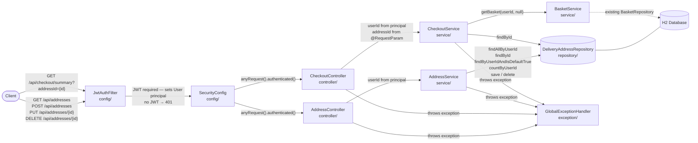

# Technical Design — FEAT-07: Checkout & Delivery Address

| Field | Value |
|---|---|
| **Feature ID** | FEAT-07 |
| **Spec** | [docs/specs/feature-07-checkout-delivery.md](../specs/feature-07-checkout-delivery.md) |
| **Plan** | [docs/plans/feature-07-checkout-delivery-plan.md](../plans/feature-07-checkout-delivery-plan.md) |
| **Status** | Draft — Awaiting Developer Approval |

---

## 1. Purpose

This document translates the approved plan into a **code-ready design**. Every class, method signature, annotation, and field is specified here. The coding phase should be mechanical — no architectural decisions left to make.

---

## 2. Architecture — Request Flow



---

## 3. Layer Responsibilities

| Layer | Class | Responsibility |
|---|---|---|
| Entity | `DeliveryAddress` | Delivery address row — owned by a `userId`; tracks `isDefault` flag |
| Repository | `DeliveryAddressRepository` | `findAllByUserId`, `findById`, `findByUserIdAndIsDefaultTrue`, `countByUserId` |
| Service | `AddressService` | CRUD for addresses; enforces ownership (403 vs 404), default-demotion, delete guard |
| Service | `CheckoutService` | Builds read-only checkout summary; delegates basket read to `BasketService` |
| Controller | `AddressController` | HTTP translation — 4 address endpoints, extracts `userId` from JWT principal |
| Controller | `CheckoutController` | HTTP translation — 1 checkout summary endpoint with required `addressId` query param |
| DTO | `AddressRequest` | Request body for `POST /api/addresses` and `PUT /api/addresses/{id}` |
| DTO | `AddressResponse` | Full address response (includes `userId` and `isDefault`) |
| DTO | `DeliveryAddressDto` | Embedded address in checkout summary (no `userId`, no `isDefault`) |
| DTO | `CheckoutSummaryResponse` | Full checkout summary response |
| Exception | `AddressNotFoundException` | Thrown when address ID does not exist → 404 |
| Exception | `AddressAccessForbiddenException` | Thrown when address belongs to another user → 403 |
| Exception | `DefaultAddressDeleteException` | Thrown when deleting the default while others exist → 400 |
| Exception | `GlobalExceptionHandler` | 3 new handlers added for the 3 new exceptions |

---

## 4. No New Maven Dependencies

No `pom.xml` changes are required. All types used in this feature are already on the classpath:

| Type | Source |
|---|---|
| `LocalDate` | `java.time` (JDK) |
| `BigDecimal` | `java.math` (JDK) |
| `@NotBlank`, `@Pattern` | `spring-boot-starter-validation` |
| `JpaRepository`, `@Entity`, `@Column` | `spring-boot-starter-data-jpa` |
| `@RestController`, `@RequestParam`, `@PathVariable` | `spring-boot-starter-web` |

---

## 5. Phase 1 — Entity

### `entity/DeliveryAddress.java`

```java
@Entity
@Table(
    name = "delivery_address",
    indexes = {
        @Index(name = "idx_delivery_address_user_id", columnList = "user_id"),
        @Index(name = "idx_delivery_address_user_default", columnList = "user_id, is_default")
    }
)
public class DeliveryAddress {

    @Id
    @GeneratedValue(strategy = GenerationType.IDENTITY)
    private Long id;

    // Owning user — non-null always.
    @Column(name = "user_id", nullable = false)
    private Long userId;

    @Column(name = "recipient_name", nullable = false, length = 100)
    private String recipientName;

    // Stored as String: exactly 10 numeric digits (leading zeros must be preserved).
    @Column(name = "phone_number", nullable = false, length = 10)
    private String phoneNumber;

    @Column(name = "line1", nullable = false, length = 200)
    private String line1;

    // Nullable — line2 is optional per spec BR-05.
    @Column(name = "line2", length = 200)
    private String line2;

    @Column(name = "city", nullable = false, length = 100)
    private String city;

    @Column(name = "state", nullable = false, length = 100)
    private String state;

    // Stored as String: exactly 6 numeric digits (leading zeros must be preserved).
    @Column(name = "pincode", nullable = false, length = 6)
    private String pincode;

    // Primitive boolean — defaults to false when a new instance is created
    // (Java primitive default). Never null: BR-04 requires a definite value.
    @Column(name = "is_default", nullable = false)
    private boolean isDefault;

    // No @PrePersist — DeliveryAddress has no createdAt timestamp field.

    // no-arg constructor + getters + setters
    // equals: id-based (same pattern as Basket/User)
    // hashCode: getClass().hashCode()
    // toString: "DeliveryAddress{id=..., userId=..., isDefault=...}"
}
```

**Why `isDefault` is primitive `boolean` and not `Boolean`:**
The primitive type has a guaranteed default value of `false`. Using the wrapper `Boolean` would allow `null`, which would violate BR-04 ("at most one `true` per user"). A `null` value cannot be compared safely with `==` or in JPQL queries. The primitive makes the invariant enforceable at the Java level before any database constraint is needed.

**Why `pincode` and `phoneNumber` are `String` and not `int`/`long`:**
Numeric-looking values that must preserve their exact digit string (including leading zeros, such as pincodes starting with `0`) cannot be stored as integers without information loss. Furthermore, no arithmetic is ever performed on them — they are identity strings, not numbers. `String` makes this intent explicit and allows the `@Pattern` regex validator to work directly on the value.

**Indexes explained:**

- `idx_delivery_address_user_id` on `(user_id)` — used by `findAllByUserId` (the list endpoint). Every address list query filters by `userId`; without this index, the query would perform a full table scan.
- `idx_delivery_address_user_default` on `(user_id, is_default)` — used by `findByUserIdAndIsDefaultTrue`. The composite index satisfies both filter columns in one B-tree lookup, making the default-demotion step in `saveAddress`/`updateAddress` as fast as a primary key lookup.

---

## 6. Phase 2 — Repository

### `repository/DeliveryAddressRepository.java`

```java
@Repository
public interface DeliveryAddressRepository extends JpaRepository<DeliveryAddress, Long> {

    // Returns all addresses for a user — used by the list endpoint (§4.1).
    List<DeliveryAddress> findAllByUserId(Long userId);

    // Locates the one address with isDefault=true for a user.
    // Used before saving/updating a new default to demote the old one (BR-04).
    Optional<DeliveryAddress> findByUserIdAndIsDefaultTrue(Long userId);

    // Counts how many addresses a user has.
    // Used by the delete guard: if count > 1 and address is default → 400 (BR-08/BR-09).
    long countByUserId(Long userId);

    // Included for potential future use (e.g. FEAT-08 address confirmation).
    // The ownership check in AddressService deliberately does NOT use this method —
    // see the rationale below.
    Optional<DeliveryAddress> findByIdAndUserId(Long id, Long userId);
}
```

**Why the ownership check uses `findById` + explicit `userId` comparison instead of `findByIdAndUserId`:**

`findByIdAndUserId` collapses two distinct failure modes into a single `Optional.empty()` result:
1. The address row does not exist at all → should return **404 Not Found**.
2. The address exists but belongs to a different user → should return **403 Forbidden**.

When only `Optional.empty()` is returned, the service cannot distinguish between these two cases and is forced to pick one status code, returning the wrong response for the other case. By calling `findById` first (404 if absent), then explicitly checking `address.getUserId().equals(userId)` (403 if mismatch), each error path maps to the correct HTTP status. The `findByIdAndUserId` method is retained in the repository for potential future use where the 404/403 distinction is not required.

---

## 7. Phase 3 — Exceptions

### `exception/AddressNotFoundException.java`

```java
public class AddressNotFoundException extends RuntimeException {

    public AddressNotFoundException(Long addressId) {
        super("Address not found: " + addressId);
    }
}
```

→ handled by `GlobalExceptionHandler` → HTTP **404 Not Found**.

### `exception/AddressAccessForbiddenException.java`

```java
public class AddressAccessForbiddenException extends RuntimeException {

    public AddressAccessForbiddenException() {
        super("You do not have permission to access this address");
    }
}
```

→ handled by `GlobalExceptionHandler` → HTTP **403 Forbidden**.

### `exception/DefaultAddressDeleteException.java`

```java
public class DefaultAddressDeleteException extends RuntimeException {

    public DefaultAddressDeleteException() {
        super("Cannot delete the default address while other addresses exist");
    }
}
```

→ handled by `GlobalExceptionHandler` → HTTP **400 Bad Request**. Message matches spec BR-08 / AC-14 exactly.

---

## 8. Phase 4 — DTOs

### `dto/AddressRequest.java`

Used as the request body for both `POST /api/addresses` and `PUT /api/addresses/{id}`.

```java
public class AddressRequest {

    @NotBlank(message = "recipientName is required")
    private String recipientName;

    @NotBlank(message = "phoneNumber is required")
    @Pattern(regexp = "\\d{10}", message = "phoneNumber must be exactly 10 numeric digits")
    private String phoneNumber;

    @NotBlank(message = "line1 is required")
    private String line1;

    // No @NotBlank — line2 is optional (spec BR-05). May be null or absent from JSON.
    private String line2;

    @NotBlank(message = "city is required")
    private String city;

    @NotBlank(message = "state is required")
    private String state;

    @NotBlank(message = "pincode is required")
    @Pattern(regexp = "\\d{6}", message = "pincode must be exactly 6 numeric digits")
    private String pincode;

    // Primitive boolean — defaults to false when omitted from JSON (Jackson maps
    // a missing boolean field to the primitive default, which is false).
    private boolean isDefault;

    // no-arg constructor + getters + setters
}
```

### `dto/AddressResponse.java`

Outbound only — no validation annotations.

```java
public class AddressResponse {
    private Long id;
    private Long userId;
    private String recipientName;
    private String phoneNumber;
    private String line1;
    private String line2;       // may be null
    private String city;
    private String state;
    private String pincode;
    private boolean isDefault;

    // no-arg constructor + getters + setters
}
```

### `dto/DeliveryAddressDto.java`

Embedded inside `CheckoutSummaryResponse`. Contains only the fields the checkout consumer needs — no `userId` (the caller already knows who they are) and no `isDefault` (irrelevant at checkout time).

```java
public class DeliveryAddressDto {
    private Long id;
    private String recipientName;
    private String phoneNumber;
    private String line1;
    private String line2;       // may be null
    private String city;
    private String state;
    private String pincode;

    // no-arg constructor + getters + setters
}
```

### `dto/CheckoutSummaryResponse.java`

```java
public class CheckoutSummaryResponse {

    // Reuses BasketItemDto from FEAT-06 — same fields the basket already exposes
    // (bookId, title, author, coverImageUrl, unitPrice, quantity, lineTotal).
    private List<BasketItemDto> items;

    private BigDecimal basketTotal;         // sum of all lineTotals

    private BigDecimal deliveryCharge;      // 0.00 when basketTotal >= 500; 50.00 otherwise

    // ISO-8601 date string (YYYY-MM-DD), e.g. "2025-08-18".
    // Returned as String (not LocalDate) to avoid requiring Jackson date configuration.
    private String estimatedDeliveryDate;

    private DeliveryAddressDto deliveryAddress;

    // no-arg constructor + getters + setters
}
```

---

## 9. Phase 5 — AddressService

### `service/AddressService.java` — full method specification

```java
@Service
public class AddressService {

    private final DeliveryAddressRepository repository;

    public AddressService(DeliveryAddressRepository repository) {
        this.repository = repository;
    }

    public List<AddressResponse> listAddresses(Long userId) { ... }

    public AddressResponse saveAddress(Long userId, AddressRequest req) { ... }

    public AddressResponse updateAddress(Long userId, Long addressId,
                                         AddressRequest req) { ... }

    public void deleteAddress(Long userId, Long addressId) { ... }

    // ------------------------------------------------------------------
    // PRIVATE HELPER
    // ------------------------------------------------------------------

    private AddressResponse toResponse(DeliveryAddress address) { ... }
}
```

#### `listAddresses(Long userId)` → `List<AddressResponse>`

```
1. List<DeliveryAddress> addresses = repository.findAllByUserId(userId)
2. return addresses.stream().map(this::toResponse).toList()
   // Returns empty list when user has no saved addresses — no exception thrown (spec §4.1)
```

#### `saveAddress(Long userId, AddressRequest req)` → `AddressResponse`

```
1. if req.isDefault() == true:
       a. Optional<DeliveryAddress> existingDefault =
              repository.findByUserIdAndIsDefaultTrue(userId)
       b. if existingDefault.isPresent():
              existingDefault.get().setIsDefault(false)
              repository.save(existingDefault.get())
2. DeliveryAddress address = new DeliveryAddress()
   address.setUserId(userId)
   address.setRecipientName(req.getRecipientName())
   address.setPhoneNumber(req.getPhoneNumber())
   address.setLine1(req.getLine1())
   address.setLine2(req.getLine2())
   address.setCity(req.getCity())
   address.setState(req.getState())
   address.setPincode(req.getPincode())
   address.setDefault(req.isDefault())
3. DeliveryAddress saved = repository.save(address)
4. return toResponse(saved)
```

#### `updateAddress(Long userId, Long addressId, AddressRequest req)` → `AddressResponse`

```
1. DeliveryAddress address = repository.findById(addressId)
       .orElseThrow(() -> new AddressNotFoundException(addressId))
2. if !address.getUserId().equals(userId):
       throw new AddressAccessForbiddenException()
3. if req.isDefault() == true:
       a. Optional<DeliveryAddress> existingDefault =
              repository.findByUserIdAndIsDefaultTrue(userId)
       b. if existingDefault.isPresent()
          && !existingDefault.get().getId().equals(addressId):
              existingDefault.get().setDefault(false)
              repository.save(existingDefault.get())
4. address.setRecipientName(req.getRecipientName())
   address.setPhoneNumber(req.getPhoneNumber())
   address.setLine1(req.getLine1())
   address.setLine2(req.getLine2())
   address.setCity(req.getCity())
   address.setState(req.getState())
   address.setPincode(req.getPincode())
   address.setDefault(req.isDefault())
5. DeliveryAddress saved = repository.save(address)
6. return toResponse(saved)
```

#### `deleteAddress(Long userId, Long addressId)` → `void`

```
1. DeliveryAddress address = repository.findById(addressId)
       .orElseThrow(() -> new AddressNotFoundException(addressId))
2. if !address.getUserId().equals(userId):
       throw new AddressAccessForbiddenException()
3. long count = repository.countByUserId(userId)
4. if count > 1 && address.isDefault():
       throw new DefaultAddressDeleteException()
   // If count == 1, deletion is allowed regardless of isDefault (spec BR-09)
5. repository.delete(address)
```

#### `toResponse(DeliveryAddress address)` — private helper

```
AddressResponse response = new AddressResponse()
response.setId(address.getId())
response.setUserId(address.getUserId())
response.setRecipientName(address.getRecipientName())
response.setPhoneNumber(address.getPhoneNumber())
response.setLine1(address.getLine1())
response.setLine2(address.getLine2())
response.setCity(address.getCity())
response.setState(address.getState())
response.setPincode(address.getPincode())
response.setDefault(address.isDefault())
return response
```

---

## 10. Phase 6 — CheckoutService

### `service/CheckoutService.java` — full method specification

```java
@Service
public class CheckoutService {

    private final BasketService basketService;
    private final DeliveryAddressRepository repository;

    public CheckoutService(BasketService basketService,
                           DeliveryAddressRepository repository) {
        this.basketService = basketService;
        this.repository = repository;
    }

    public CheckoutSummaryResponse getCheckoutSummary(Long userId,
                                                       Long addressId) { ... }
}
```

#### `getCheckoutSummary(Long userId, Long addressId)` → `CheckoutSummaryResponse`

```
1. BasketResponse basketResponse = basketService.getBasket(userId, null)
   // Passing null as sessionId signals an authenticated user — same call pattern
   // as BasketController uses for authenticated requests.

2. if basketResponse.getItems().isEmpty():
       throw new IllegalArgumentException("Basket is empty")
   // The existing IllegalArgumentException handler in GlobalExceptionHandler
   // catches this and returns 400. No new exception class needed.

3. DeliveryAddress address = repository.findById(addressId)
       .orElseThrow(() -> new AddressNotFoundException(addressId))

4. if !address.getUserId().equals(userId):
       throw new AddressAccessForbiddenException()

5. BigDecimal deliveryCharge =
       basketResponse.getBasketTotal()
                     .compareTo(new BigDecimal("500")) >= 0
           ? BigDecimal.ZERO
           : new BigDecimal("50.00")
   // compareTo is used (not equals) because BigDecimal equality is scale-sensitive:
   // new BigDecimal("500").equals(new BigDecimal("500.00")) is false.
   // compareTo ignores scale — 500 and 500.00 are treated as equal.

6. String estimatedDeliveryDate = LocalDate.now().plusDays(3).toString()
   // LocalDate.toString() produces "YYYY-MM-DD" (ISO-8601) with no time zone.
   // No business-day logic applied (spec BR-11).

7. DeliveryAddressDto addressDto = new DeliveryAddressDto()
   addressDto.setId(address.getId())
   addressDto.setRecipientName(address.getRecipientName())
   addressDto.setPhoneNumber(address.getPhoneNumber())
   addressDto.setLine1(address.getLine1())
   addressDto.setLine2(address.getLine2())
   addressDto.setCity(address.getCity())
   addressDto.setState(address.getState())
   addressDto.setPincode(address.getPincode())

8. CheckoutSummaryResponse response = new CheckoutSummaryResponse()
   response.setItems(basketResponse.getItems())
   response.setBasketTotal(basketResponse.getBasketTotal())
   response.setDeliveryCharge(deliveryCharge)
   response.setEstimatedDeliveryDate(estimatedDeliveryDate)
   response.setDeliveryAddress(addressDto)
   return response
```

---

## 11. Phase 7 — Controllers

### `controller/AddressController.java`

```java
@RestController
@RequestMapping("/api/addresses")
public class AddressController {

    private final AddressService addressService;

    public AddressController(AddressService addressService) {
        this.addressService = addressService;
    }

    // GET /api/addresses → 200
    @GetMapping
    public List<AddressResponse> listAddresses(Authentication authentication) {
        Long userId = ((User) authentication.getPrincipal()).getId();
        return addressService.listAddresses(userId);
    }

    // POST /api/addresses → 201
    @PostMapping
    @ResponseStatus(HttpStatus.CREATED)
    public AddressResponse saveAddress(@Valid @RequestBody AddressRequest req,
                                       Authentication authentication) {
        Long userId = ((User) authentication.getPrincipal()).getId();
        return addressService.saveAddress(userId, req);
    }

    // PUT /api/addresses/{id} → 200
    @PutMapping("/{id}")
    public AddressResponse updateAddress(@PathVariable Long id,
                                          @Valid @RequestBody AddressRequest req,
                                          Authentication authentication) {
        Long userId = ((User) authentication.getPrincipal()).getId();
        return addressService.updateAddress(userId, id, req);
    }

    // DELETE /api/addresses/{id} → 204
    @DeleteMapping("/{id}")
    @ResponseStatus(HttpStatus.NO_CONTENT)
    public void deleteAddress(@PathVariable Long id,
                               Authentication authentication) {
        Long userId = ((User) authentication.getPrincipal()).getId();
        addressService.deleteAddress(userId, id);
    }
}
```

**Why `Authentication` is never null here:** unlike `BasketController` (which supports guests), all `/api/addresses/**` endpoints require a valid JWT. The existing `anyRequest().authenticated()` catch-all in `SecurityConfig` ensures that Spring Security returns **401** before the controller method is invoked when no JWT is present. The controller can therefore cast `authentication.getPrincipal()` directly without a null check.

**Why no `SecurityConfig` changes are needed:** `/api/addresses/**` and `/api/checkout/**` fall through to the existing `anyRequest().authenticated()` rule. No new `requestMatchers` entries are required.

### `controller/CheckoutController.java`

```java
@RestController
@RequestMapping("/api/checkout")
public class CheckoutController {

    private final CheckoutService checkoutService;

    public CheckoutController(CheckoutService checkoutService) {
        this.checkoutService = checkoutService;
    }

    // GET /api/checkout/summary?addressId={id} → 200
    @GetMapping("/summary")
    public CheckoutSummaryResponse getCheckoutSummary(
            @RequestParam Long addressId,       // required = true (Spring default)
            Authentication authentication) {
        Long userId = ((User) authentication.getPrincipal()).getId();
        return checkoutService.getCheckoutSummary(userId, addressId);
    }
}
```

**Why omitting `addressId` returns 400 automatically:** `@RequestParam` without `required = false` defaults to `required = true`. When the parameter is missing from the query string, Spring MVC throws `MissingServletRequestParameterException` before the method is invoked. The existing `Exception` handler (catch-all 500) does not fire — Spring's own MVC exception handling maps this to **400 Bad Request**. No additional handler is needed.

---

## 12. Phase 8 — GlobalExceptionHandler Additions

Three new `@ExceptionHandler` methods added to `GlobalExceptionHandler`, following the exact same pattern as the existing FEAT-06 handlers:

```java
// ================================================================
// FEAT-07 handlers
// ================================================================

/** 404 — requested address does not exist */
@ExceptionHandler(AddressNotFoundException.class)
public ResponseEntity<ErrorResponse> handleAddressNotFound(
        AddressNotFoundException ex, HttpServletRequest request) {

    ErrorResponse body = new ErrorResponse(
        HttpStatus.NOT_FOUND.value(),
        HttpStatus.NOT_FOUND.getReasonPhrase(),
        ex.getMessage(),
        request.getRequestURI()
    );
    return ResponseEntity.status(HttpStatus.NOT_FOUND).body(body);
}

/** 403 — address belongs to a different user */
@ExceptionHandler(AddressAccessForbiddenException.class)
public ResponseEntity<ErrorResponse> handleAddressAccessForbidden(
        AddressAccessForbiddenException ex, HttpServletRequest request) {

    ErrorResponse body = new ErrorResponse(
        HttpStatus.FORBIDDEN.value(),
        HttpStatus.FORBIDDEN.getReasonPhrase(),
        ex.getMessage(),
        request.getRequestURI()
    );
    return ResponseEntity.status(HttpStatus.FORBIDDEN).body(body);
}

/** 400 — attempting to delete the default address while others exist */
@ExceptionHandler(DefaultAddressDeleteException.class)
public ResponseEntity<ErrorResponse> handleDefaultAddressDelete(
        DefaultAddressDeleteException ex, HttpServletRequest request) {

    ErrorResponse body = new ErrorResponse(
        HttpStatus.BAD_REQUEST.value(),
        HttpStatus.BAD_REQUEST.getReasonPhrase(),
        ex.getMessage(),
        request.getRequestURI()
    );
    return ResponseEntity.status(HttpStatus.BAD_REQUEST).body(body);
}
```

---

## 13. Test Designs

### 13.1 `AddressRepositoryTest` (`@DataJpaTest`)

Test class location: `src/test/java/com/harsh/bookstore/repository/AddressRepositoryTest.java`

Setup: each test uses `@Autowired DeliveryAddressRepository`; `@Transactional` is provided by `@DataJpaTest` (each test rolls back automatically).

```java
@DataJpaTest
class AddressRepositoryTest {

    @Autowired
    private DeliveryAddressRepository repository;

    // helper: build and save a minimal DeliveryAddress
    private DeliveryAddress save(Long userId, boolean isDefault) {
        DeliveryAddress a = new DeliveryAddress();
        a.setUserId(userId);
        a.setRecipientName("Test User");
        a.setPhoneNumber("9876543210");
        a.setLine1("1 Test Street");
        a.setCity("Mumbai");
        a.setState("Maharashtra");
        a.setPincode("400001");
        a.setDefault(isDefault);
        return repository.save(a);
    }
}
```

| Test method | Setup | Assertion |
|---|---|---|
| `findAllByUserId_returnsCorrectAddresses` | Save 2 addresses for userId=1L and 1 address for userId=2L | `findAllByUserId(1L)` returns exactly 2 results; none has userId=2L |
| `findByUserIdAndIsDefaultTrue_returnsDefault` | Save one address with `isDefault=false` and one with `isDefault=true` for userId=1L | `findByUserIdAndIsDefaultTrue(1L)` returns `Optional.of(...)` with `isDefault=true` |
| `findByUserIdAndIsDefaultTrue_empty_whenNoDefault` | Save one address for userId=1L with `isDefault=false` | `findByUserIdAndIsDefaultTrue(1L)` returns `Optional.empty()` |
| `countByUserId_returnsCorrectCount` | Save 3 addresses for userId=1L | `countByUserId(1L)` returns `3L` |

### 13.2 `AddressServiceTest` (`@ExtendWith(MockitoExtension.class)`)

Test class location: `src/test/java/com/harsh/bookstore/service/AddressServiceTest.java`

```java
@ExtendWith(MockitoExtension.class)
class AddressServiceTest {

    @Mock
    private DeliveryAddressRepository repository;

    private AddressService addressService;

    private static final Long USER_ID = 1L;
    private static final Long OTHER_USER_ID = 2L;
    private static final Long ADDRESS_ID = 10L;

    @BeforeEach
    void setUp() {
        addressService = new AddressService(repository);
    }

    // Stub save to return its argument unchanged (same lenient pattern as BasketServiceTest).
    // lenient() avoids UnnecessaryStubbing errors in read-only / exception-path tests.
    private void stubSave() {
        lenient().when(repository.save(any(DeliveryAddress.class)))
                 .thenAnswer(inv -> inv.getArgument(0));
    }

    private DeliveryAddress address(Long id, Long userId, boolean isDefault) {
        DeliveryAddress a = new DeliveryAddress();
        a.setId(id);
        a.setUserId(userId);
        a.setRecipientName("Test User");
        a.setPhoneNumber("9876543210");
        a.setLine1("1 Test Street");
        a.setCity("Mumbai");
        a.setState("Maharashtra");
        a.setPincode("400001");
        a.setDefault(isDefault);
        return a;
    }

    private AddressRequest validRequest(boolean isDefault) {
        AddressRequest req = new AddressRequest();
        req.setRecipientName("Test User");
        req.setPhoneNumber("9876543210");
        req.setLine1("1 Test Street");
        req.setCity("Mumbai");
        req.setState("Maharashtra");
        req.setPincode("400001");
        req.setDefault(isDefault);
        return req;
    }
}
```

| Test method | Mock setup | What it asserts |
|---|---|---|
| `listAddresses_returnsUserAddresses` | `when(repository.findAllByUserId(USER_ID)).thenReturn(List.of(address(10L, USER_ID, false), address(11L, USER_ID, true)))` | Returned list has 2 `AddressResponse` elements with correct `userId` |
| `saveAddress_success` | `stubSave()` + `when(repository.findByUserIdAndIsDefaultTrue(USER_ID)).thenReturn(Optional.empty())` | `AddressResponse` has all fields from the request; `id` from the saved entity |
| `saveAddress_demotesExistingDefault` | `stubSave()` + `when(repository.findByUserIdAndIsDefaultTrue(USER_ID)).thenReturn(Optional.of(address(9L, USER_ID, true)))` | `repository.save(...)` is called twice: once for the old default (with `isDefault=false`) and once for the new address |
| `updateAddress_success` | `when(repository.findById(ADDRESS_ID)).thenReturn(Optional.of(address(ADDRESS_ID, USER_ID, false)))` + `stubSave()` + `when(repository.findByUserIdAndIsDefaultTrue(USER_ID)).thenReturn(Optional.empty())` | Returned `AddressResponse` reflects all fields from the request |
| `updateAddress_forbidden` | `when(repository.findById(ADDRESS_ID)).thenReturn(Optional.of(address(ADDRESS_ID, OTHER_USER_ID, false)))` | `assertThatThrownBy(...)` → `AddressAccessForbiddenException` |
| `updateAddress_notFound` | `when(repository.findById(ADDRESS_ID)).thenReturn(Optional.empty())` | `assertThatThrownBy(...)` → `AddressNotFoundException` with message containing `ADDRESS_ID` |
| `deleteAddress_success` | `when(repository.findById(ADDRESS_ID)).thenReturn(Optional.of(address(ADDRESS_ID, USER_ID, false)))` + `when(repository.countByUserId(USER_ID)).thenReturn(2L)` | `repository.delete(address)` is called; no exception thrown |
| `deleteAddress_forbidden` | `when(repository.findById(ADDRESS_ID)).thenReturn(Optional.of(address(ADDRESS_ID, OTHER_USER_ID, false)))` | `assertThatThrownBy(...)` → `AddressAccessForbiddenException` |
| `deleteAddress_notFound` | `when(repository.findById(ADDRESS_ID)).thenReturn(Optional.empty())` | `assertThatThrownBy(...)` → `AddressNotFoundException` |
| `deleteAddress_defaultWithOthersPresent_throws` | `when(repository.findById(ADDRESS_ID)).thenReturn(Optional.of(address(ADDRESS_ID, USER_ID, true)))` + `when(repository.countByUserId(USER_ID)).thenReturn(2L)` | `assertThatThrownBy(...)` → `DefaultAddressDeleteException` with message `"Cannot delete the default address while other addresses exist"` |
| `deleteAddress_onlyAddress_succeeds` | `when(repository.findById(ADDRESS_ID)).thenReturn(Optional.of(address(ADDRESS_ID, USER_ID, true)))` + `when(repository.countByUserId(USER_ID)).thenReturn(1L)` | `repository.delete(address)` is called; no exception thrown (even though `isDefault=true`) |

### 13.3 `CheckoutServiceTest` (`@ExtendWith(MockitoExtension.class)`)

Test class location: `src/test/java/com/harsh/bookstore/service/CheckoutServiceTest.java`

`@Mock BasketService basketService` — BasketService is mocked (not the real implementation). This keeps the test a true unit test: it verifies `CheckoutService` logic in isolation without exercising basket persistence.

`@Mock DeliveryAddressRepository repository`

```java
@ExtendWith(MockitoExtension.class)
class CheckoutServiceTest {

    @Mock private BasketService basketService;
    @Mock private DeliveryAddressRepository repository;

    private CheckoutService checkoutService;

    private static final Long USER_ID = 1L;
    private static final Long ADDRESS_ID = 10L;

    @BeforeEach
    void setUp() {
        checkoutService = new CheckoutService(basketService, repository);
    }

    // Builds a BasketResponse with one item and the given total.
    private BasketResponse basketWithTotal(BigDecimal total) {
        BasketItemDto item = new BasketItemDto();
        item.setBookId(1L);
        item.setTitle("Clean Code");
        item.setAuthor("Robert C. Martin");
        item.setUnitPrice(total);
        item.setQuantity(1);
        item.setLineTotal(total);

        BasketResponse r = new BasketResponse();
        r.setItems(List.of(item));
        r.setTotalItems(1);
        r.setBasketTotal(total);
        return r;
    }

    private DeliveryAddress address(Long userId) {
        DeliveryAddress a = new DeliveryAddress();
        a.setId(ADDRESS_ID);
        a.setUserId(userId);
        a.setRecipientName("Test User");
        a.setPhoneNumber("9876543210");
        a.setLine1("1 Test Street");
        a.setCity("Mumbai");
        a.setState("Maharashtra");
        a.setPincode("400001");
        return a;
    }
}
```

| Test method | Mock setup | What it asserts |
|---|---|---|
| `getCheckoutSummary_freeDelivery` | `basketWithTotal(new BigDecimal("500.00"))` + valid address owned by `USER_ID` | `deliveryCharge` is `0.00`; `deliveryAddress.getId()` equals `ADDRESS_ID` |
| `getCheckoutSummary_paidDelivery` | `basketWithTotal(new BigDecimal("499.99"))` + valid address | `deliveryCharge` is `50.00` |
| `getCheckoutSummary_emptyBasket_throws` | `basketService.getBasket(USER_ID, null)` returns `BasketResponse` with empty `items` list | `assertThatThrownBy(...)` → `IllegalArgumentException` with message `"Basket is empty"` |
| `getCheckoutSummary_addressNotFound_throws` | Non-empty basket + `repository.findById(ADDRESS_ID)` returns `Optional.empty()` | `assertThatThrownBy(...)` → `AddressNotFoundException` |
| `getCheckoutSummary_addressForbidden_throws` | Non-empty basket + address owned by `OTHER_USER_ID` (not `USER_ID`) | `assertThatThrownBy(...)` → `AddressAccessForbiddenException` |
| `getCheckoutSummary_estimatedDeliveryDate` | Non-empty basket + valid address | `response.getEstimatedDeliveryDate()` equals `LocalDate.now().plusDays(3).toString()` |
| `getCheckoutSummary_itemsAndTotals` | `basketWithTotal(new BigDecimal("598.00"))` with one item + valid address | `response.getItems()` has 1 item; `response.getBasketTotal()` equals `598.00` (passed through unchanged from `BasketService`) |

### 13.4 `AddressControllerTest` (`@WebMvcTest`)

Test class location: `src/test/java/com/harsh/bookstore/controller/AddressControllerTest.java`

Class-level boilerplate (same as `BasketControllerTest` but with `@MockBean AddressService`):

```java
@WebMvcTest(value = AddressController.class,
        excludeAutoConfiguration = UserDetailsServiceAutoConfiguration.class)
@Import(SecurityConfig.class)
class AddressControllerTest {

    @Autowired private MockMvc mockMvc;
    @Autowired private ObjectMapper objectMapper;

    @MockBean private AddressService addressService;

    // Required by JwtAuthFilter (part of SecurityConfig)
    @MockBean private JwtService jwtService;
    @MockBean private UserRepository userRepository;
```

**How to test authenticated endpoints:** address endpoints require a JWT. In `@WebMvcTest`, supply a mock `Authorization: Bearer <token>` header. Stub `jwtService.extractUsername(token)` to return `"test@example.com"` and `userRepository.findByEmail(...)` to return a `User` with `id=1L`. Spring Security's `JwtAuthFilter` will call these stubs and place the `User` as the `Authentication` principal — exactly as in production.

**How to test 401:** perform the request with **no `Authorization` header**. Because all address endpoints fall under `anyRequest().authenticated()`, Spring Security's filter chain returns **401** before the controller method is ever reached. No service stub is needed for these tests.

| Test method | Endpoint | Mock setup | Expected |
|---|---|---|---|
| `listAddresses_returns200` | `GET /api/addresses` (with JWT) | `addressService.listAddresses(1L)` returns list of 2 | 200 + JSON array with 2 elements |
| `listAddresses_returns401_noJwt` | `GET /api/addresses` (no header) | — | 401 |
| `listAddresses_returns200_emptyList` | `GET /api/addresses` (with JWT) | `addressService.listAddresses(1L)` returns `List.of()` | 200 + `[]` |
| `saveAddress_returns201` | `POST /api/addresses` (with JWT, valid body) | `addressService.saveAddress(1L, any)` returns `AddressResponse` with `id=10L` | 201 + `$.id == 10` |
| `saveAddress_returns400_missingField` | `POST /api/addresses` (with JWT, body missing `recipientName`) | — (Bean Validation fires before service) | 400 + `$.message` contains "recipientName is required" |
| `saveAddress_returns400_invalidPincode` | `POST /api/addresses` (with JWT, `pincode="12345"`) | — | 400 + `$.message` == `"pincode must be exactly 6 numeric digits"` |
| `saveAddress_returns400_invalidPhone` | `POST /api/addresses` (with JWT, `phoneNumber="12345"`) | — | 400 + `$.message` == `"phoneNumber must be exactly 10 numeric digits"` |
| `updateAddress_returns200` | `PUT /api/addresses/10` (with JWT, valid body) | `addressService.updateAddress(1L, 10L, any)` returns updated `AddressResponse` | 200 + updated fields |
| `updateAddress_returns400_validation` | `PUT /api/addresses/10` (with JWT, invalid body) | — | 400 |
| `updateAddress_returns403` | `PUT /api/addresses/10` (with JWT) | `addressService.updateAddress(...)` throws `AddressAccessForbiddenException` | 403 + `$.message` == `"You do not have permission to access this address"` |
| `updateAddress_returns404` | `PUT /api/addresses/10` (with JWT) | `addressService.updateAddress(...)` throws `AddressNotFoundException(10L)` | 404 + `$.message` == `"Address not found: 10"` |
| `deleteAddress_returns204` | `DELETE /api/addresses/10` (with JWT) | `addressService.deleteAddress(1L, 10L)` completes normally | 204, no response body |
| `deleteAddress_returns400_defaultGuard` | `DELETE /api/addresses/10` (with JWT) | `addressService.deleteAddress(...)` throws `DefaultAddressDeleteException` | 400 + `$.message` == `"Cannot delete the default address while other addresses exist"` |
| `deleteAddress_returns403` | `DELETE /api/addresses/10` (with JWT) | `addressService.deleteAddress(...)` throws `AddressAccessForbiddenException` | 403 |
| `deleteAddress_returns404` | `DELETE /api/addresses/10` (with JWT) | `addressService.deleteAddress(...)` throws `AddressNotFoundException(10L)` | 404 |

### 13.5 `CheckoutControllerTest` (`@WebMvcTest`)

Test class location: `src/test/java/com/harsh/bookstore/controller/CheckoutControllerTest.java`

Same boilerplate as `AddressControllerTest` but `@MockBean CheckoutService checkoutService` instead of `AddressService`.

**How missing `@RequestParam` produces 400:** `@RequestParam Long addressId` is required by default. When the parameter is absent, Spring MVC throws `MissingServletRequestParameterException` **before** invoking the handler method and **before** calling any service. The existing Spring MVC exception handling maps this to 400. The `checkoutService` mock is never called in this test.

| Test method | Endpoint | Mock setup | Expected |
|---|---|---|---|
| `getCheckoutSummary_returns200` | `GET /api/checkout/summary?addressId=10` (with JWT) | `checkoutService.getCheckoutSummary(1L, 10L)` returns full `CheckoutSummaryResponse` | 200 + `$.deliveryCharge`, `$.estimatedDeliveryDate`, `$.deliveryAddress`, `$.items` all present |
| `getCheckoutSummary_returns400_missingAddressId` | `GET /api/checkout/summary` (no `addressId`, with JWT) | — (Spring MVC handles before service) | 400 |
| `getCheckoutSummary_returns400_emptyBasket` | `GET /api/checkout/summary?addressId=10` (with JWT) | `checkoutService.getCheckoutSummary(...)` throws `IllegalArgumentException("Basket is empty")` | 400 + `$.message` == `"Basket is empty"` |
| `getCheckoutSummary_returns403` | `GET /api/checkout/summary?addressId=10` (with JWT) | `checkoutService.getCheckoutSummary(...)` throws `AddressAccessForbiddenException` | 403 |
| `getCheckoutSummary_returns404` | `GET /api/checkout/summary?addressId=10` (with JWT) | `checkoutService.getCheckoutSummary(...)` throws `AddressNotFoundException(10L)` | 404 |
| `getCheckoutSummary_returns401_noJwt` | `GET /api/checkout/summary?addressId=10` (no header) | — | 401 |

---

## 14. Design Decisions

| # | Decision | Rationale |
|---|---|---|
| D-01 | `findById` + explicit `userId` check instead of `findByIdAndUserId` for ownership enforcement | `findByIdAndUserId` returns `Optional.empty()` for both "address does not exist" and "address belongs to someone else". It is impossible to return the correct status code (404 vs 403) from a single `Optional.empty()`. Using `findById` first (404 if absent) then an explicit `userId` equality check (403 if mismatch) gives each error path its correct HTTP status. |
| D-02 | `isDefault` is primitive `boolean`, not wrapper `Boolean` | The primitive defaults to `false` on a new Java instance — matching the spec requirement that `isDefault` defaults to `false` when omitted from JSON. A wrapper `Boolean` could be `null`, which would cause NullPointerExceptions in boolean comparisons and violate BR-04 at the Java level before any DB constraint fires. |
| D-03 | `pincode` and `phoneNumber` stored as `String` | Indian pincodes can start with `0` (e.g. `011001`); storing as `int` would silently drop the leading zero. Phone numbers are similarly identity strings, not quantities. No arithmetic is ever performed on either value. `String` preserves the exact digit sequence and allows `@Pattern` validation to operate directly. |
| D-04 | `DeliveryAddressDto` (no `userId`, no `isDefault`) vs `AddressResponse` (all fields) | The checkout summary consumer (FEAT-08 payment step) needs only the delivery destination fields. Exposing `userId` in the checkout response is unnecessary (the caller already authenticated) and exposing `isDefault` is meaningless in a checkout context. A lean DTO conveys intent and reduces surface area. |
| D-05 | `CheckoutService` delegates basket read to `BasketService.getBasket(userId, null)` | Duplicating the basket-loading logic in `CheckoutService` would create two diverging copies of the same business rules (basket resolution, item mapping, total calculation). `BasketService` already owns this logic; `CheckoutService` calls it as a collaborator. Passing `null` as `sessionId` is the established pattern for authenticated users — the same call `BasketController` uses. |
| D-06 | "Basket is empty" reuses `IllegalArgumentException` (no new exception class) | `GlobalExceptionHandler` already maps `IllegalArgumentException` to 400. Adding a dedicated `EmptyBasketException` class would provide no new information or distinct HTTP behaviour. The existing handler and the spec message (`"Basket is empty"`) together satisfy AC-18 with zero new files. |
| D-07 | Full `PUT` update (not partial `PATCH`) | All existing mutating endpoints in the project use `POST`/`PUT` with full replacement bodies. Introducing `PATCH` here would require null-vs-omitted field semantics, a more complex merge strategy, and more complex validation. Full `PUT` keeps the contract simple: all fields always provided, all fields always replaced. |
| D-08 | `estimatedDeliveryDate` returned as `String`, not `LocalDate` | Jackson serialises `LocalDate` as an array `[2025, 8, 18]` by default unless `JavaTimeModule` is configured. Returning a pre-formatted `LocalDate.now().plusDays(3).toString()` (`YYYY-MM-DD`) produces the correct ISO-8601 string without adding a Jackson configuration dependency or risk of format drift between environments. |
